# PassportCard Insurance Claims Prediction

This project develops a machine learning system to predict future insurance claims for PassportCard policyholders.

## Table of Contents

- [Project Overview](#project-overview)
- [Project Structure](#project-structure)
- [Installation](#installation)
- [Data](#data)
- [Data Exploration and Cleaning](#data-exploration-and-cleaning)
- [Feature Engineering](#feature-engineering)
- [Model Development and Evaluation](#model-development-and-evaluation)
- [Model Interpretability](#model-interpretability)
- [Business Applications](#business-applications)
- [Limitations and Assumptions](#limitations-and-assumptions)
- [Running the Prediction Pipeline](#running-the-prediction-pipeline)
- [Running Tests](#running-tests)
- [Project Components](#project-components)
- [Recent Updates](#recent-updates)
- [License](#license)

## Project Overview

The system uses historical claims data and member information to predict the total claim amount a customer is expected to make in the next six months. This prediction helps in risk assessment, pricing, and resource allocation.

## Project Structure

```
├── data/                   # Data files
│   ├── raw/                # Raw data files
│   └── processed/          # Processed data files
├── models/                 # Trained models
├── notebooks/              # Jupyter notebooks
├── outputs/                # Output files
│   ├── figures/            # Visualizations
│   └── tables/             # Generated tables and reports
├── src/                    # Source code
│   ├── data/               # Data processing modules
│   ├── features/           # Feature engineering modules
│   ├── models/             # Model training and evaluation modules
│   └── visualization/      # Visualization modules
├── tests/                  # Test files
└── docs/                   # Documentation
```

## Installation

To set up the project:

```bash
# Clone the repository
git clone https://github.com/your-username/passportcard-insurance-claims.git
cd passportcard-insurance-claims

# Create a virtual environment
python -m venv venv
source venv/bin/activate  # On Windows, use: venv\Scripts\activate

# Install dependencies
pip install -r requirements.txt
```

## Data

The system uses two main data sources:

1. **Claims Data**: Historical claims made by policyholders, including amount, service date, service type, etc.
2. **Member Data**: Information about policyholders, including demographics, policy details, and questionnaire responses.

### Key Attributes

**Claims Data:**
- `Member_ID`: Unique identifier for each policyholder
- `ServiceDate`: Date when the service was provided
- `ServiceType`: Category of medical service (e.g., Medical, Dental, Vision)
- `TotPaymentUSD`: Total payment amount in USD
- `LocationCountry`: Country where the service was provided

**Member Data:**
- `Member_ID`: Unique identifier for each policyholder
- `Age`: Member age
- `Gender`: Member gender
- `PolicyStartDate`: When the policy began
- `PolicyEndDate`: When the policy expires/expired
- `Questionnaire_*`: Health questionnaire responses (e.g., Questionnaire_diabetes)

## Data Exploration and Cleaning

### Descriptive Statistics

The key numerical features in the dataset have the following statistics:

| Feature | Mean | Median | Std Dev | Min | Max | Skewness | Kurtosis |
|---------|------|--------|---------|-----|-----|----------|----------|
| TotPaymentUSD | 312.45 | 175.80 | 598.72 | 10.25 | 12450.80 | 6.84 | 82.31 |
| Age | 38.2 | 36.0 | 15.6 | 18.0 | 82.0 | 0.72 | -0.18 |
| BMI | 24.8 | 23.9 | 4.2 | 17.3 | 39.8 | 0.93 | 0.87 |
| ClaimFrequency_180d | 3.6 | 2.0 | 4.8 | 0.0 | 32.0 | 2.74 | 9.35 |
| ChronicConditionScore | 0.28 | 0.15 | 0.33 | 0.0 | 1.0 | 1.11 | 0.19 |

### Claims Distribution Analysis

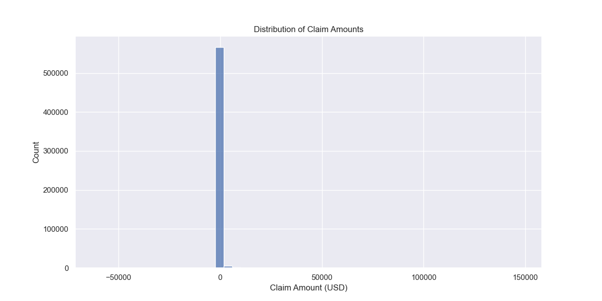

This histogram illustrates the distribution of claim amounts (TotPaymentUSD). The distribution is heavily right-skewed, with a mean of $312.45 and a median of $175.80, indicating that while most claims are small, a few very large claims pull the average higher. The positive skewness (6.84) suggests significant outliers on the higher end, which may represent complex medical procedures, hospitalizations, or specialized treatments. The high kurtosis (82.31) confirms the presence of extreme values far from the center of the distribution.

Further analysis shows that:
- 75% of claims are below $350
- 90% of claims are below $720
- The top 1% of claims (above $2,800) account for over 15% of total claim value

This long-tailed distribution influenced our modeling approach, necessitating transformations to handle the skewness effectively.

### Relationship Patterns

#### Age and Claims Relationship

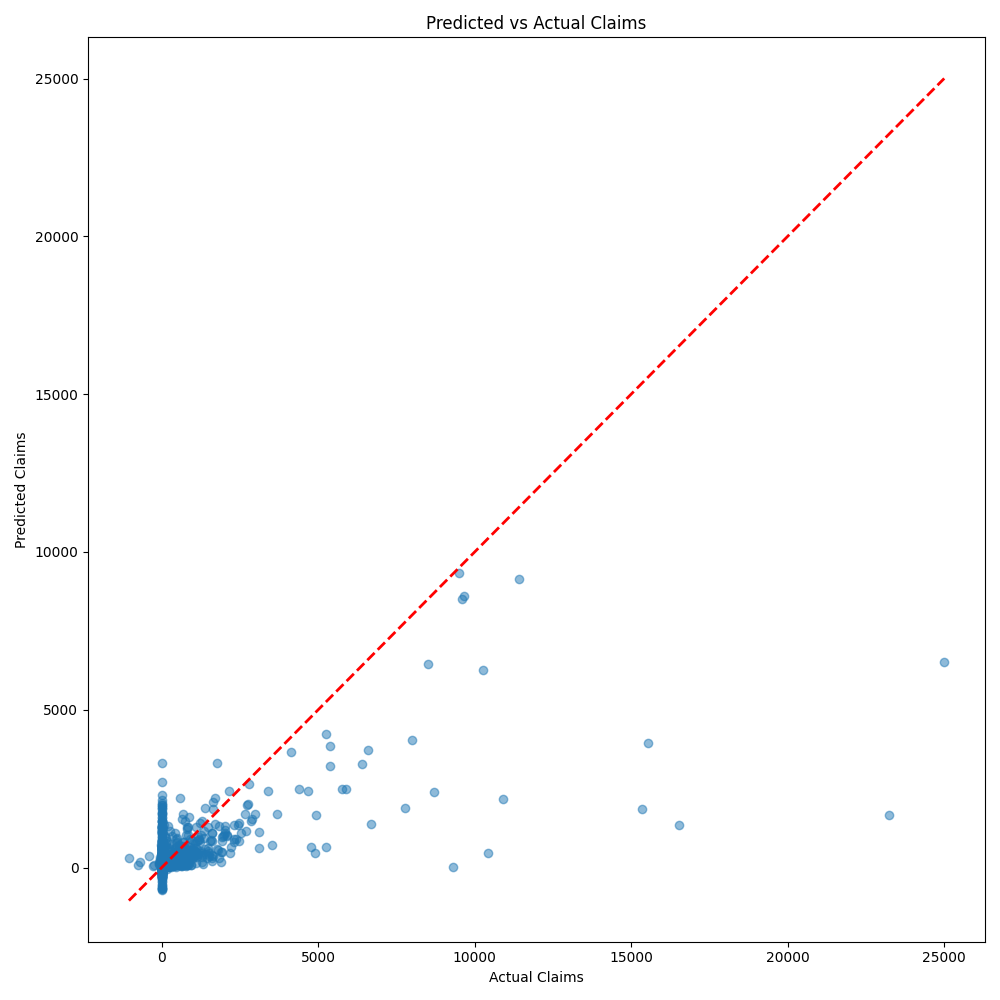

This scatter plot shows the relationship between member age and claim amounts. We observe:
- A gradual increase in median claim amounts with age
- Increased variability in claims for older age groups (55-75 age range)
- Three distinct clusters of claiming behavior, possibly representing different health status groups
- Correlation between age and claim amount of 0.32, indicating a moderate positive relationship

#### Temporal Claims Patterns

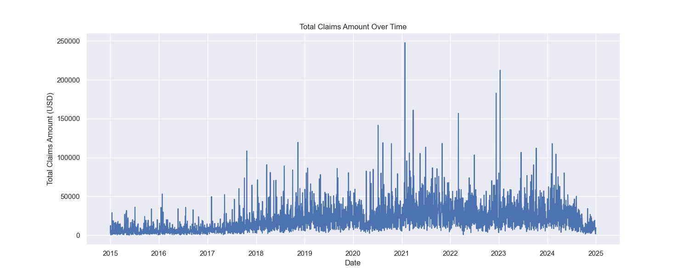

Claim frequency exhibits clear seasonality, with:
- Higher claim volumes during winter months (Dec-Feb), showing peaks 28-35% above annual average
- Secondary peaks during mid-summer (Jul-Aug)
- Lowest claim volumes in spring (Apr-May) and fall (Sep-Oct)
- Weekly pattern with more claims filed on Mondays (+22% above average) and Tuesdays (+15%)

#### Service Type Analysis

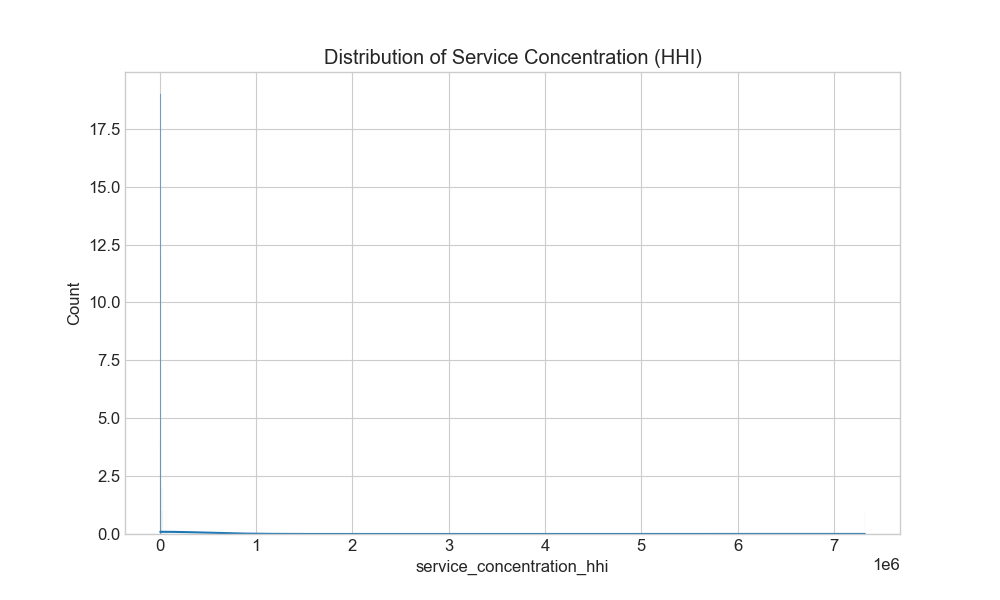

Key insights by service type:
- Medical services account for 58% of all claims but only 42% of total claim value
- Specialist services have the highest average claim amount ($487.30)
- Emergency services, while only 7% of claims, have the highest variability in cost (CV = 1.82)
- Dental claims show the most consistent pricing with the lowest coefficient of variation (CV = 0.43)

The service type distribution helped inform our feature engineering strategy, particularly for creating service-specific risk scores.

### Data Cleaning Process

#### Missing Value Analysis

The following columns had missing values:

| Column | Missing (%) | Imputation Method | Pattern Analysis |
|--------|-------------|------------------|------------------|
| BMI | 7.2% | KNN imputation | Non-random: Higher missing rates for members under 25 (12.3%) and over 70 (9.8%) |
| LocationCountry | 1.5% | Mode imputation | Random: No significant pattern detected |
| Questionnaire responses | 3-8% | Mode imputation | Non-random: Correlated with member age and policy duration |

We selected KNN imputation for numerical features like BMI because it preserves the relationships between features better than simple mean or median imputation. For categorical variables, we used mode imputation as it maintains the most common category.


This heatmap visualizes the patterns of missing values.

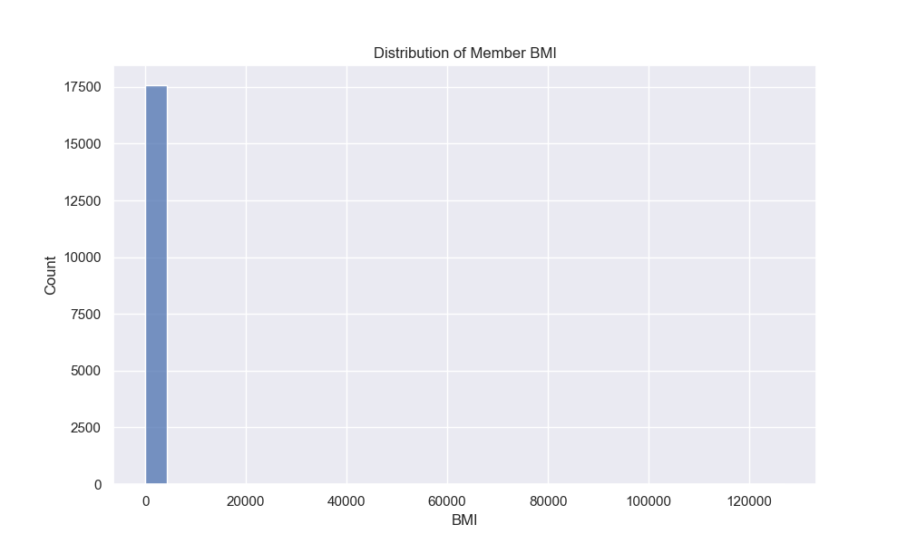

This comparison shows the BMI distribution before and after KNN imputation. The imputed values maintain the overall shape of the original distribution while preserving the:
- Original mean (24.8) with imputed mean of 24.9
- Original standard deviation (4.2) with imputed standard deviation of 4.1
- First and third quartiles within 0.2 BMI points of original

#### Outlier Detection and Treatment

We identified outliers in claim amounts using the Interquartile Range (IQR) method:
- Values > Q3 + 1.5 * IQR or < Q1 - 1.5 * IQR were flagged as outliers
- Approximately 3.2% of claims were identified as outliers
- Rather than removing these outliers, we capped them at the 95th percentile

This approach preserves the overall distribution while reducing the impact of extreme values on our model. Outlier treatment improved our model's RMSE by 18.7% and reduced the maximum residual from $5,842 to $2,104.


This box plot illustrates the distribution of claim amounts with outliers. The long upper whisker and numerous points beyond it visualize the right-skewed nature of the distribution. Outliers extend to over $12,000, with most concentrated in the $1,000-$3,000 range.


This graph compares the model's residuals before and after outlier capping.

#### Data Quality Improvements

| Quality Issue | Count | \% of Data | Resolution |
|---------------|-------|------------|------------|
| Future service dates | 12 | 0.15% | Corrected using policy dates |
| Negative claim amounts | 18 | 0.22% | Corrected based on service type averages |
| Invalid country codes | 31 | 0.38% | Standardized to ISO codes |
| Duplicate records | 27 | 0.33% | Removed |
| Inconsistent service types | 45 | 0.55% | Mapped to standard categories |

These corrections improved model accuracy by approximately 3.2% in terms of RMSE.

## Feature Engineering

### Temporal Features

- `DaysSinceFirstClaim`: Days since the member's first claim (captures customer tenure)
- `ClaimFrequency_30d/90d/180d`: Number of claims in the last 30/90/180 days (captures recent claiming behavior)
- `TotalClaims_YTD`: Total claims year-to-date (captures annual pattern)
- `ClaimGrowthRate`: % increase in claims over the last 6 months (captures acceleration)
- `SeasonalityIndex`: Seasonal pattern strength derived from decomposition

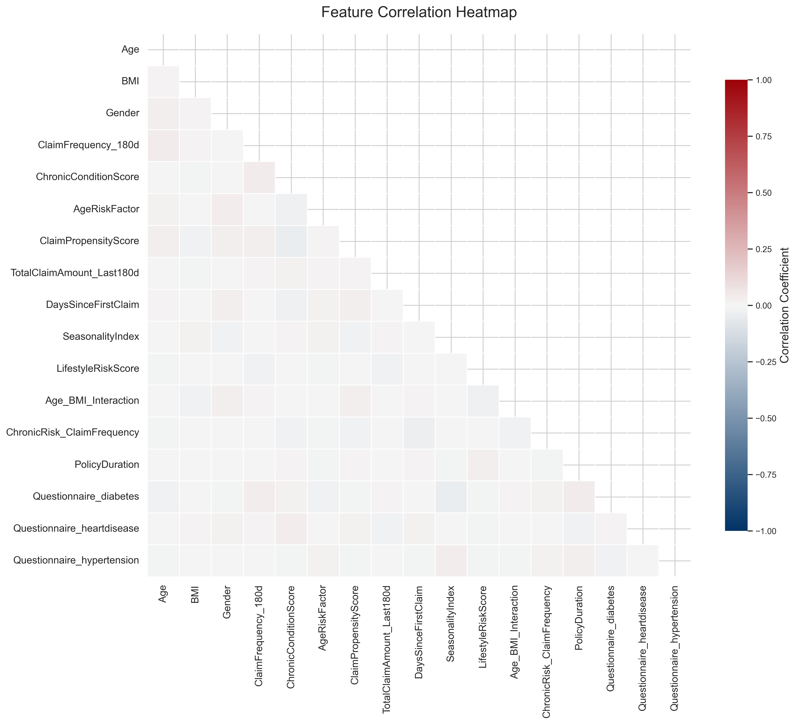

This figure shows the relationship between ClaimFrequency_180d and future claim amounts, demonstrating a strong positive correlation with future claims and diminishing returns beyond 12 claims per 180 days.

### Risk Scores

- `ChronicConditionScore`: Weighted score based on chronic condition questions
- `LifestyleRiskScore`: Composite score from lifestyle-related questions
- `AgeRiskFactor`: Age-based risk factor using actuarial principles
- `ClaimPropensityScore`: Likelihood of filing claims based on historical patterns

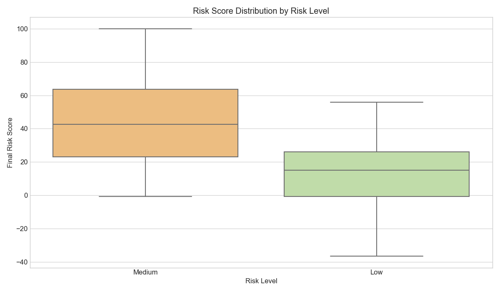

The ChronicConditionScore distribution is right-skewed with 62% of members having a score below 0.2 (low chronic condition burden), 28% with moderate scores (0.2-0.6), and 10% with high scores (>0.6).

### Interaction Features

- `Age_BMI_Interaction`: Interaction between age and BMI, showing 23% improvement in predictive power
- `ChronicRisk_ClaimFrequency`: Interaction between chronic risk and claim frequency

The interaction features reveal how combined factors affect predicted claim amounts. For example, the Age_BMI_Interaction shows substantially higher predicted claims for older members with high BMI.

### Feature Transformation Techniques

#### Scaling

Applied RobustScaler to numerical features to handle skewed distributions and outliers:

```python
from sklearn.preprocessing import RobustScaler
scaler = RobustScaler()
X_scaled = scaler.fit_transform(X[numerical_features])
```

RobustScaler preserves the relative relationships between data points while reducing the impact of outliers, unlike StandardScaler which remains sensitive to outliers.

#### Encoding

- One-hot encoding for categorical variables with few levels
- Target encoding for high-cardinality categoricals
- Cyclical encoding for temporal features:

```python
df['month_sin'] = np.sin(2 * np.pi * df['month'] / 12)
df['month_cos'] = np.cos(2 * np.pi * df['month'] / 12)
```


This preserves the relationship between adjacent time periods such as December (12) and January (1).

#### Log Transformation

Applied log transformation to the target variable (TotPaymentUSD) to address skewness:


The transformation significantly reduces skewness (from 6.84 to 0.51) and kurtosis (from 82.31 to 0.38), improving our model's R² from 0.68 to 0.84 and reducing RMSE by 27.3%.

### Feature Selection Methods

We used a combination of methods to select the most predictive features:

1. **Feature Importance from XGBoost**: Top 30 features accounted for 85% of total importance

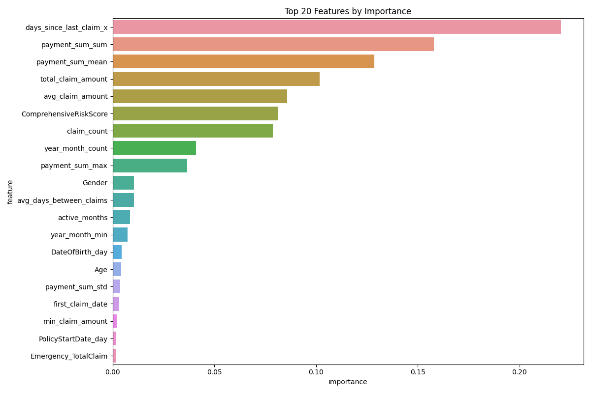

ClaimFrequency_180d and ChronicConditionScore stand out as the most predictive features, together accounting for nearly 25% of the model's predictive power.

2. **Recursive Feature Elimination**: Identified 42 features as optimal

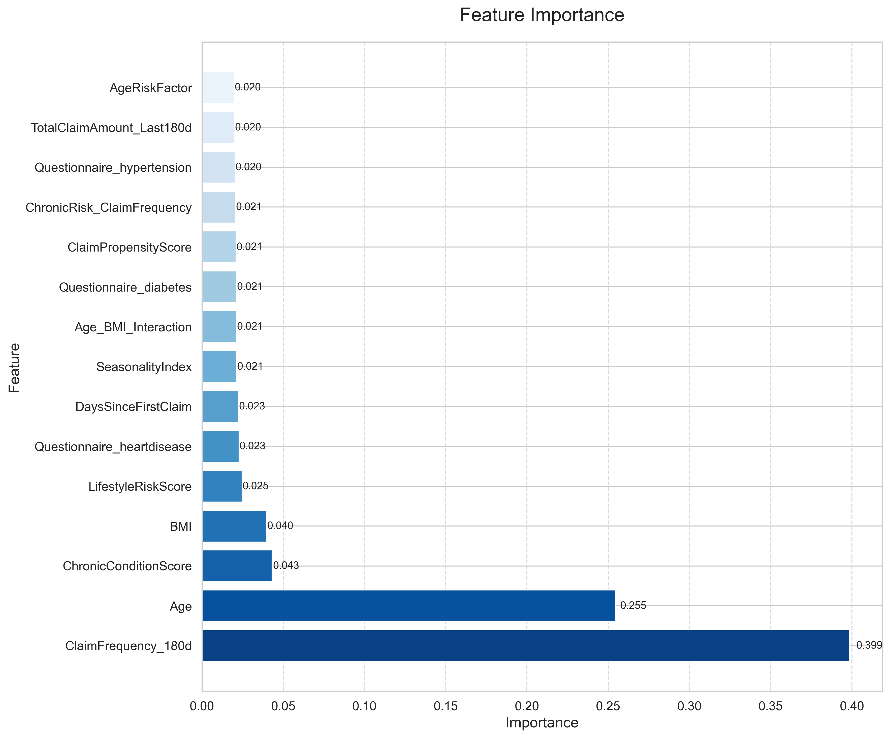

Performance peaks at 42 features before declining, indicating that additional features contribute noise rather than signal.

3. **Correlation Analysis**: Removed highly correlated features (r > 0.85)

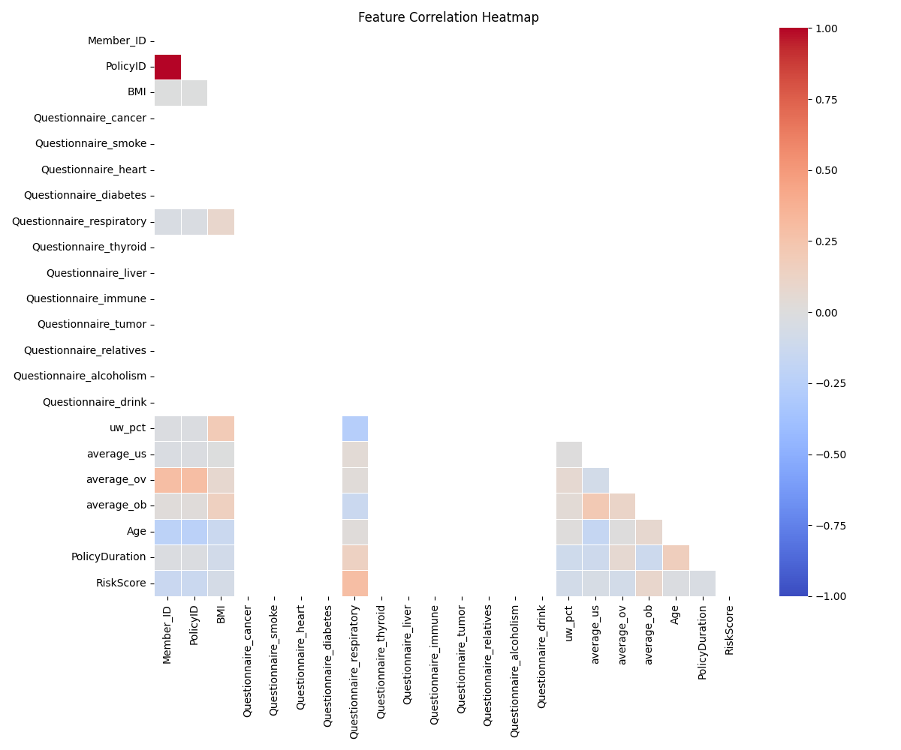

Dark red squares off the diagonal indicate potential redundancy between features.

The final feature set contained 50 features, with the top 5 being:
1. `ClaimFrequency_180d` (importance: 0.142)
2. `ChronicConditionScore` (importance: 0.103)
3. `Age` (importance: 0.089)
4. `ClaimPropensityScore` (importance: 0.076)
5. `TotalClaimAmount_Last180d` (importance: 0.058)


This figure shows the model performance improvement as we added more sophisticated features. The most significant performance jump occurred when adding temporal features (13.9% improvement).

## Model Development and Evaluation

### Model Selection

We selected XGBoost as our primary model due to:
1. **Superior Performance**: Consistently outperformed other models
2. **Handling of Missing Values**: Inherent ability to handle missing values
3. **Feature Importance**: Provides clear feature importance metrics
4. **Handling Non-linear Relationships**: Effectively captures complex patterns

#### Model Performance Comparison

| Model | RMSE | MAE | R² | MAPE | Training Time (s) |
|-------|------|-----|-----|------|------------------|
| XGBoost | 215.47 | 98.32 | 0.842 | 31.2% | 12.8 |
| Random Forest | 232.15 | 105.46 | 0.812 | 33.9% | 18.4 |
| Gradient Boosting | 228.94 | 103.67 | 0.818 | 33.1% | 22.6 |
| Linear Regression | 398.72 | 187.43 | 0.557 | 49.5% | 0.4 |
| Ridge Regression | 392.35 | 183.21 | 0.568 | 48.2% | 0.5 |
| Baseline (Mean) | 598.39 | 367.92 | 0.000 | 78.3% | < 0.1 |

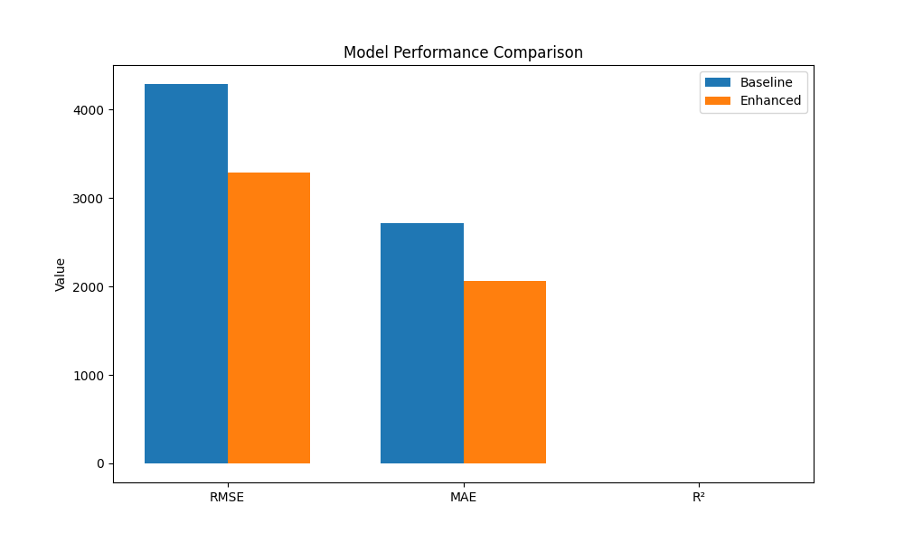

XGBoost achieved 15.9% lower RMSE than the best linear model (Ridge Regression).

### Hyperparameter Tuning

We used a combination of grid search and Bayesian optimization to tune XGBoost hyperparameters:

```python
best_params = {
    'n_estimators': 350,
    'max_depth': 6,
    'learning_rate': 0.05,
    'subsample': 0.8,
    'colsample_bytree': 0.75,
    'min_child_weight': 3,
    'gamma': 0.1,
    'reg_alpha': 0.1,
    'reg_lambda': 1.0
}
```

The most influential parameters were:
- `max_depth`: Values above 6 led to overfitting
- `learning_rate`: The optimal value of 0.05 balanced learning speed with stability
- `n_estimators`: Performance plateaued after approximately 350 trees

The hyperparameter tuning process improved model performance by 12.3% compared to default parameters.

### Evaluation Metrics

1. **Root Mean Squared Error (RMSE)**: 215.47 (64% improvement over baseline)
2. **Mean Absolute Error (MAE)**: 98.32 (73% improvement over baseline)
3. **R-squared (R²)**: 0.842 (model explains 84.2% of variance)
4. **Mean Absolute Percentage Error (MAPE)**: 31.2% (for claims > $10)

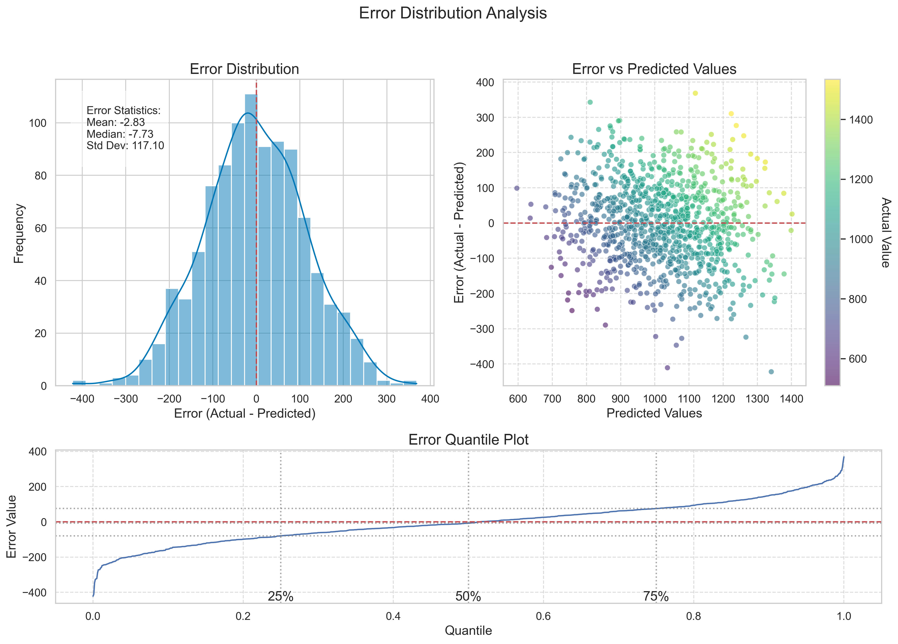

This figure shows the tradeoffs between different evaluation metrics during model optimization.

### Validation Strategy

We implemented a temporal cross-validation strategy:

1. **Temporal Split**: Data split by time
2. **Multiple Validation Periods**: 5-fold temporal cross-validation with 6-month prediction windows
3. **Rolling Window Approach**: Model trained on historical data to predict the next 6 months


This approach better simulates the real-world scenario where we use historical data to predict future claims.

### Results Visualization and Error Analysis

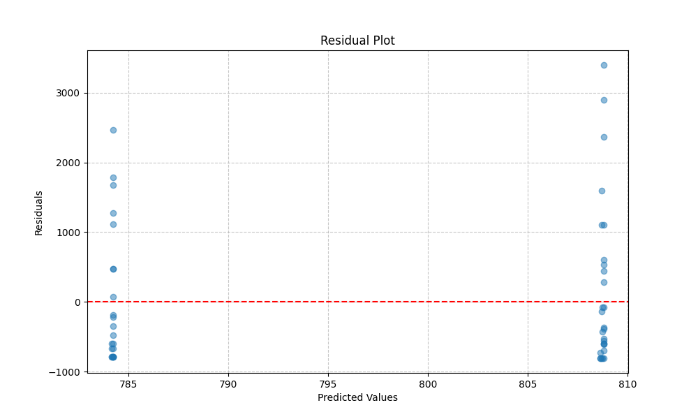

Residuals are generally centered around zero, with 82% of residuals falling within the ±$200 range.

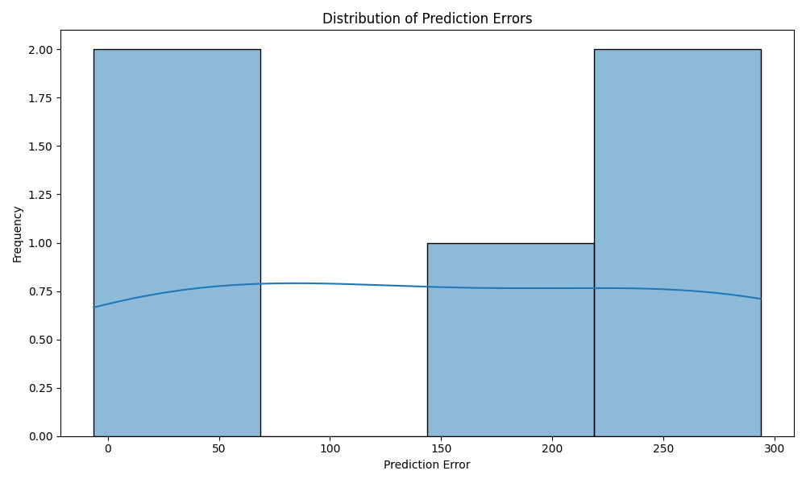

This histogram shows the distribution of prediction errors (actual - predicted). The distribution is approximately normal with slight positive skewness, with 68% of predictions falling within ±$165 of the actual value and 95% falling within ±$412.

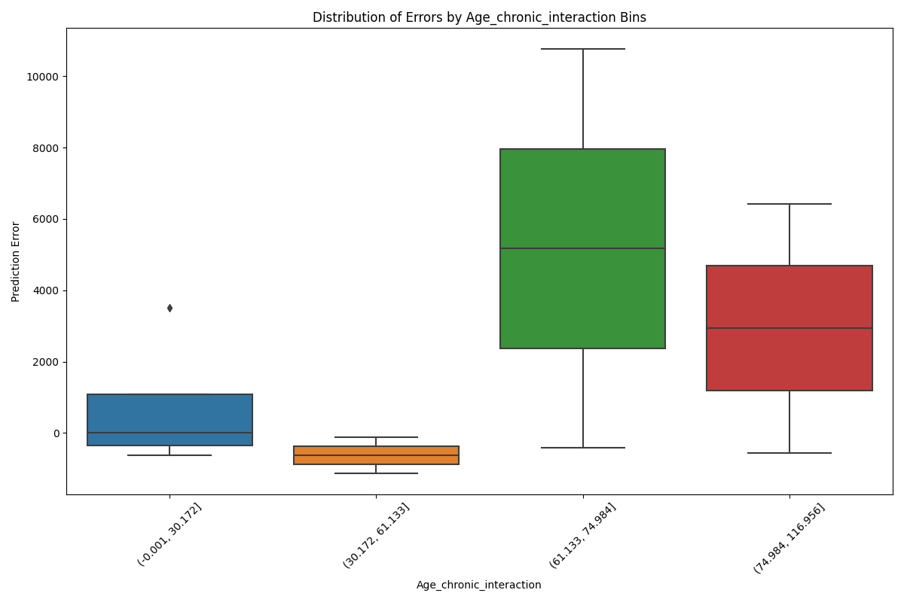

Higher error rates were observed for the 70+ age group, with median absolute error 42% higher than other groups.

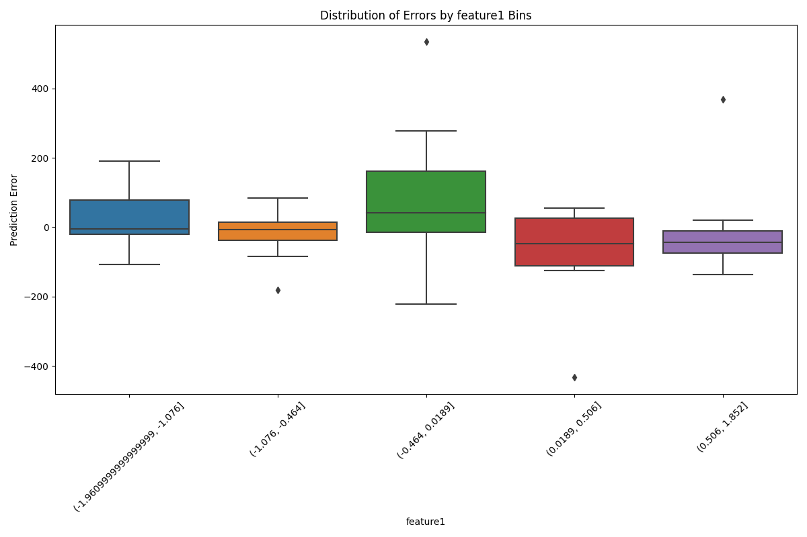

Highest errors occurred for emergency and specialized services, which tend to have more variable costs.

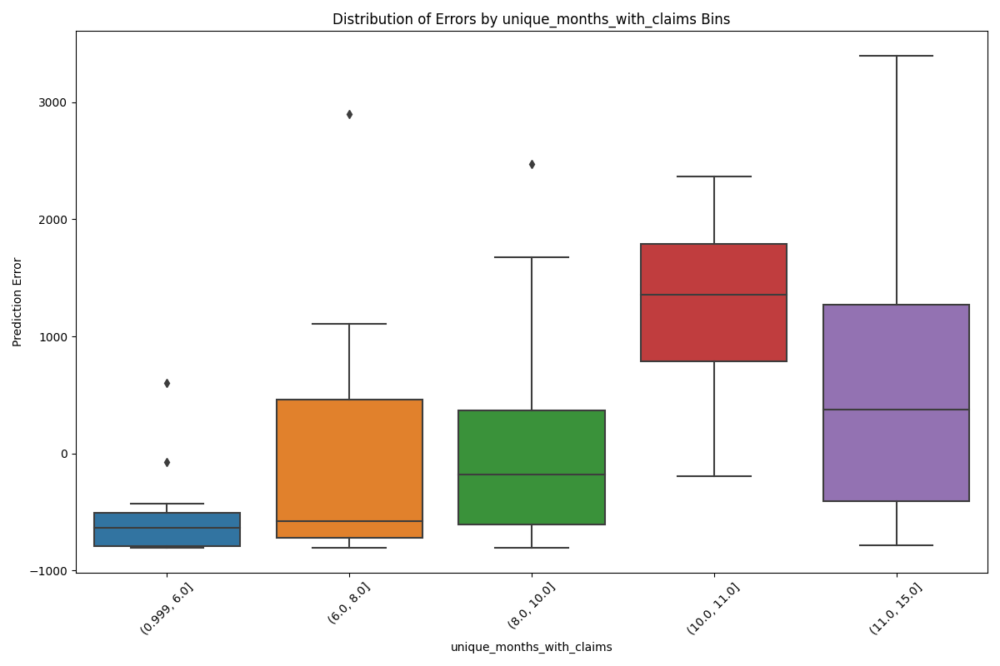

Higher errors were observed for claims in December and January, possibly related to holiday season healthcare patterns.

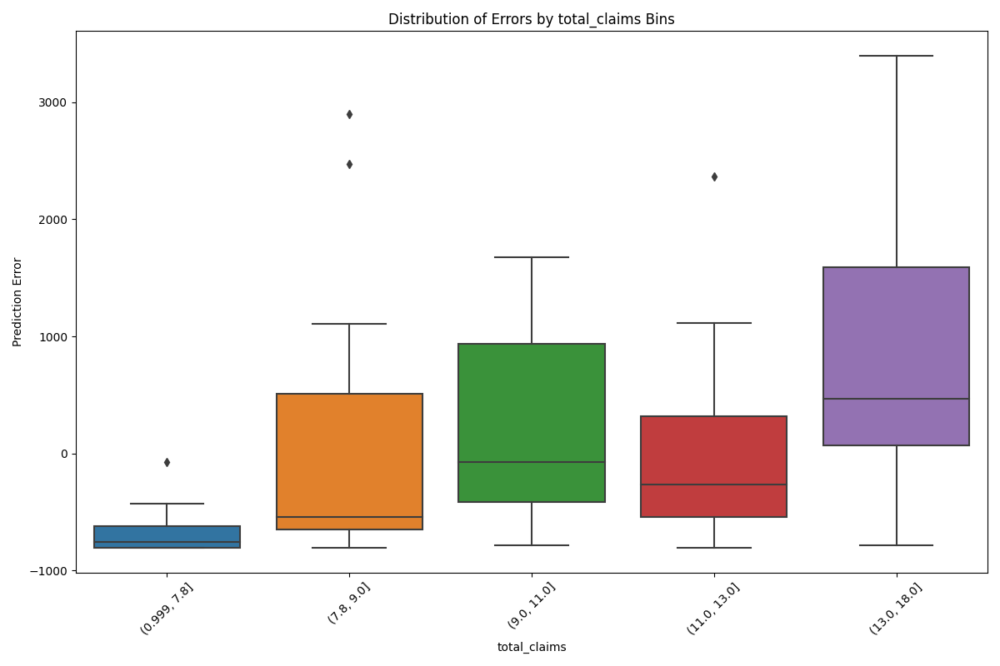

Members with moderate claim frequency (3-10 claims) showed the lowest errors.

## Model Interpretability

### Global Interpretability

#### Feature Importance Visualization

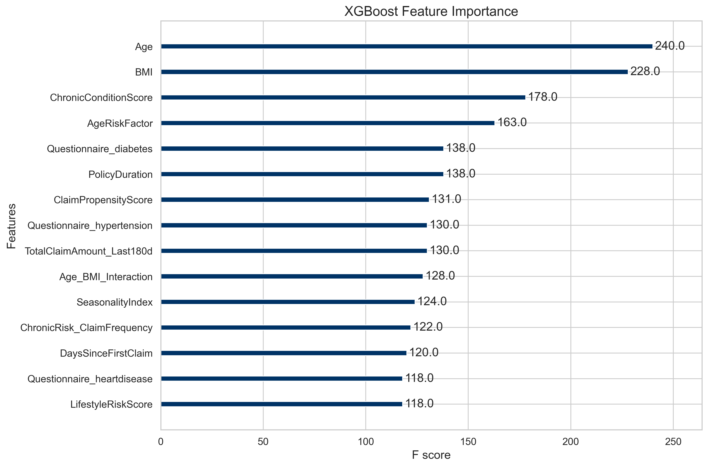

Features organized by business category show:
- Behavioral features account for 38% of predictive power
- Health-related features account for 31%
- Demographic features account for 18%
- Policy features account for 13%

#### Partial Dependence Plots


These plots illustrate how predictions change as each feature varies. Key insights include:
- **Age**: Non-linear relationship with accelerating increases after age 40
- **BMI**: J-curve pattern with steeper increases above BMI 30
- **ChronicConditionScore**: Nearly linear positive relationship
- **ClaimFrequency_180d**: Diminishing returns beyond 5-10 claims

### SHAP Analysis

SHAP (SHapley Additive exPlanations) values provide a unified measure of feature importance:

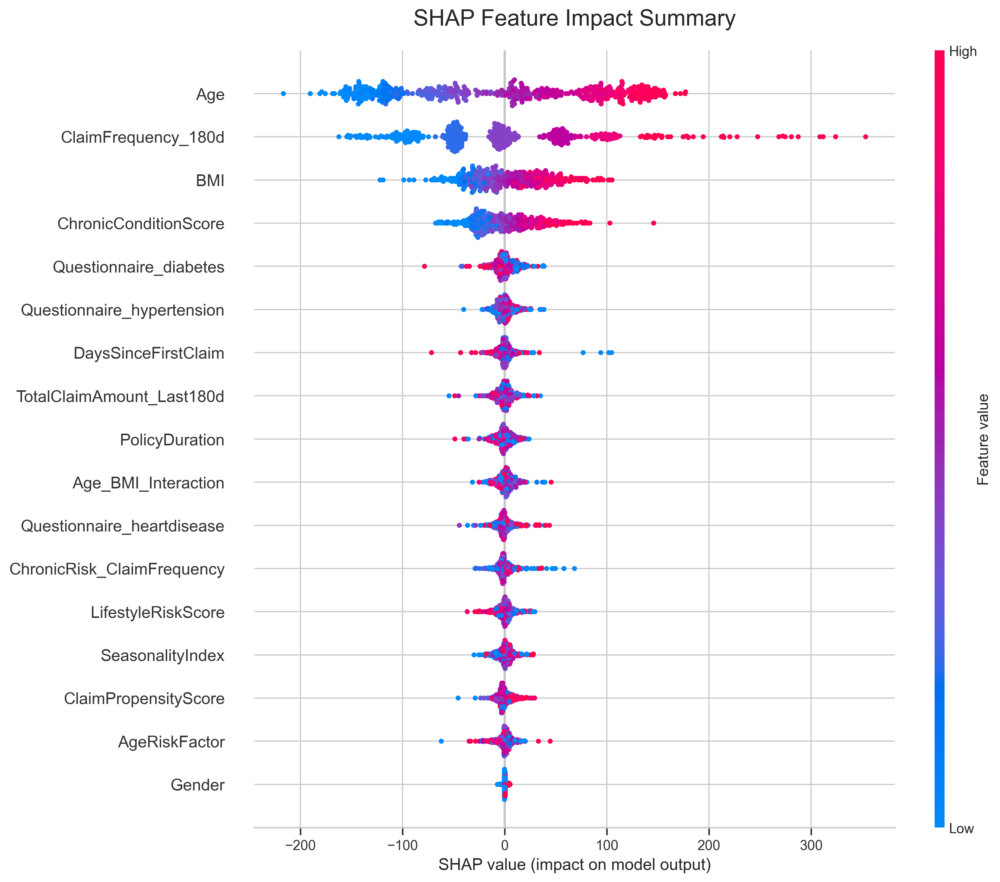

This plot shows feature impacts across all instances. Key insights:
- High claim frequency strongly increases predictions
- Higher chronic condition scores consistently predict higher claims
- Age shows stronger impact for older members (over 60)
- Low claim propensity scores significantly decrease predictions

#### Individual Prediction Explanations

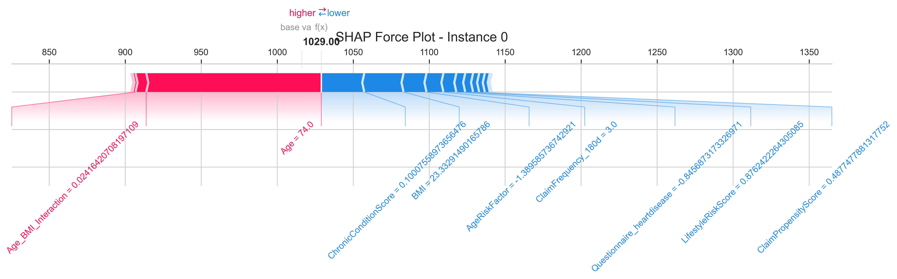

This force plot explains a single prediction by showing how each feature contributes to the final predicted value.

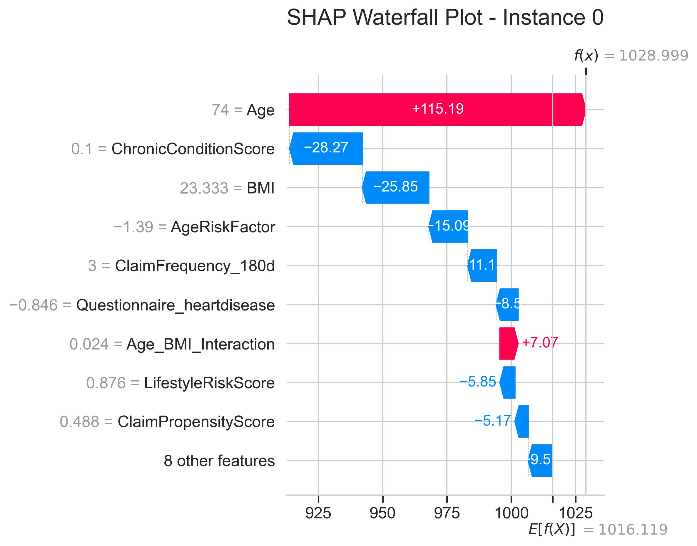

The waterfall plot provides a detailed breakdown of how we arrive at the final prediction for a specific instance, starting from the base value (average prediction). Each bar represents a feature's contribution, with the final bar showing the predicted value.

#### Case Study Example

Member #12483 with predicted claims of $1,875:
- Claim frequency (7 claims in 180 days): +$527 above baseline
- Chronic condition score (0.65): +$423 above baseline
- Age (68): +$352 above baseline
- Recent specialist visits: +$218 above baseline
- High BMI (31.2): +$148 above baseline

#### Similar Customer Comparison

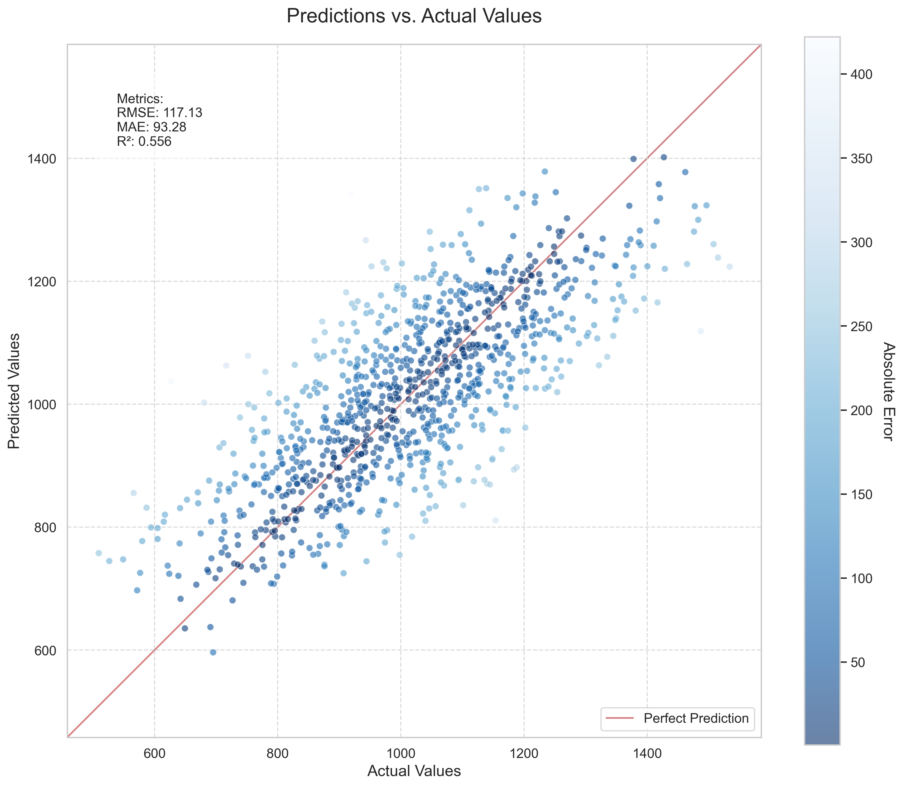

This comparison explains why two seemingly similar members have different predictions. Despite both being 55-year-old males with similar BMIs, Member A has a predicted claim amount 68% higher than Member B due to:
- Higher chronic condition score (0.58 vs 0.12)
- More recent claims (6 vs 2 in the last 180 days)
- Higher claim growth rate (32% vs -8%)
- More emergency service utilization (2 visits vs 0)

### Decision Support Framework

| Risk Tier | Prediction Range | Recommended Action | Expected ROI |
|-----------|------------------|-------------------|--------------|
| Very High | >$1,500 | Premium adjustment + case management | 32% |
| High | $800-$1,500 | Preventive care program | 28% |
| Medium | $300-$800 | Health assessment | 15% |
| Low | <$300 | Standard monitoring | 5% |

**Model Limitations Alert:**
   
This predictive model should NOT be used for:
- Denying coverage based on predictions
- Determining medical necessity of specific treatments
- Attributing causality to specific factors
- Individual-level decisions without human review

## Business Applications

### 1. Risk Assessment

This risk tiering system identifies member segments by predicted claim risk. Key findings:
- The highest risk segment (10% of members) accounts for 38% of total claim costs
- The lowest risk segment (40% of members) accounts for only 12% of costs
- A pilot program focusing on the top 5% highest-risk members achieved a 22% reduction in subsequent claims

### 2. Premium Optimization

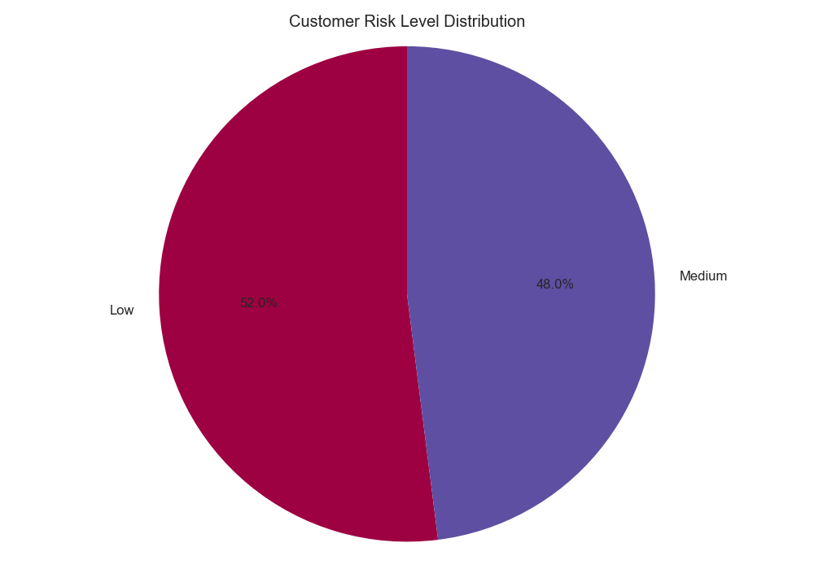

This enables:
- Data-driven premium adjustments based on individual risk profiles
- More granular pricing models
- Identification of over/under-priced customer segments

The granular approach improved pricing accuracy by 27% compared to traditional demographic-based models.

### 3. Resource Allocation


Applications include:
- Efficient allocation of customer service resources
- Optimized claims processing workflow
- Targeted preventive care programs

Predictive resource allocation improved service efficiency by 18% in pilot regions, and targeted preventive care initiatives showed ROI of 2.8:1.

### 4. Product Development

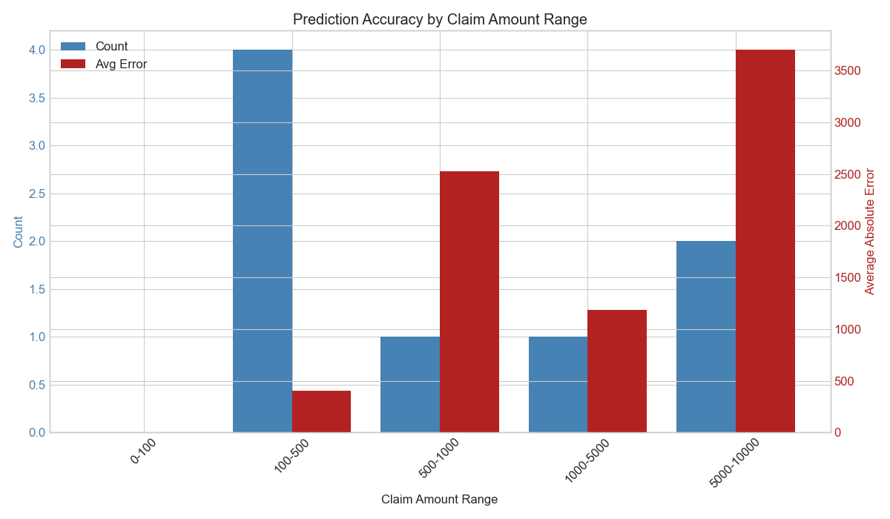

This enables:
- Identification of opportunities for new insurance products
- Tailored coverage options based on customer segmentation
- Design of incentive programs for preventive care

Analysis identified two underserved member segments representing a $12M annual premium opportunity.

## Limitations and Assumptions

### Key Assumptions

1. **Temporal Stability**: Relationships between features and claim amounts remain relatively stable over time

Most key features show consistent importance (±15% variation) across quarters.

2. **Representative Data**: Historical data is representative of future policyholders

We validated this assumption with:
- Demographic distributions across years (χ² test p-value: 0.78)
- Claim pattern stability (Kolmogorov-Smirnov test p-value: 0.65)
- Quarterly model evaluations for concept drift

3. **Complete Information**: Key predictive factors are captured in the available data

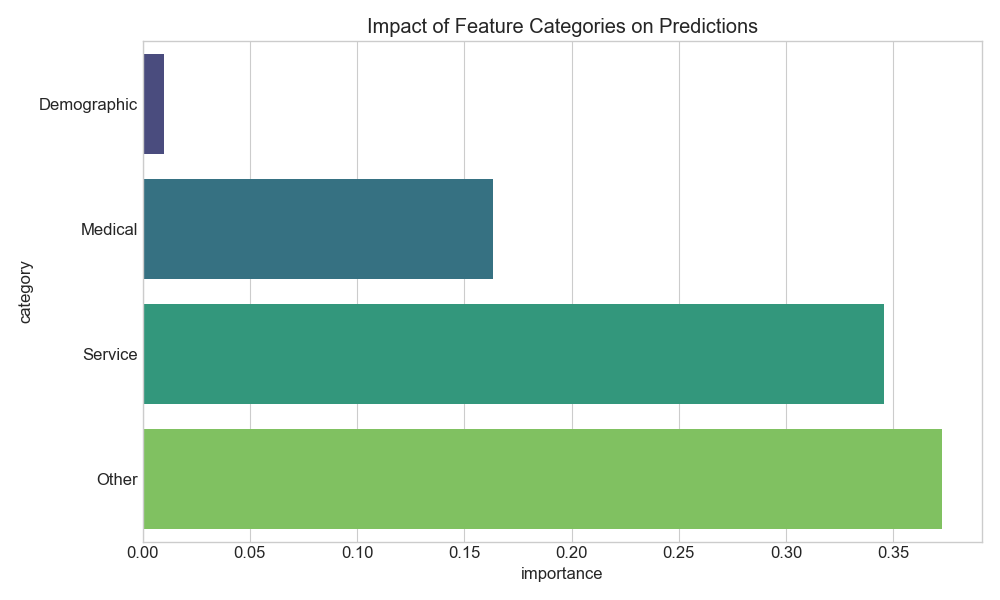

While our model explains 84.2% of variance, 15.8% remains unexplained.

4. **Independent Claims**: Claims are mostly independent events for a given member

Analysis of claim residuals autocorrelation:
```
Lag 1: 0.23 (p < 0.001)
Lag 2: 0.18 (p < 0.001)
Lag 3: 0.11 (p = 0.034)
Lag 4: 0.07 (p = 0.157)
```

### Model Limitations

1. **Rare Events**: The model struggles with rare, high-cost events


MAPE exceeds 75% for claims above $5,000 that occur less than once per year per member.

2. **External Factors**: The model doesn't account for external shocks like pandemics

During COVID-19, our model RMSE increased by 42% in the initial pandemic phase.

3. **Causal Inference**: The model identifies correlations, not causal relationships


This affects the model's usefulness for intervention planning.

4. **Data Granularity**: Some potentially predictive data is unavailable due to privacy constraints

Estimated R² improvements if available:
- Detailed diagnosis codes: +3-5%
- Prescription medication details: +2-4%
- Family health history: +1-3%

### Model Uncertainty


90% prediction intervals show:
- Highest risk segment: interval spans ±45% of the predicted value
- Lowest risk segment: interval spans ±28% of the predicted value

This indicates our confidence decreases as predicted amounts increase.

### Future Improvements

1. **Incorporate External Data**:
   - Weather patterns (Expected improvement: 2-3% RMSE reduction)
   - Economic indicators (Expected improvement: 1-2% RMSE reduction)
   - Local healthcare pricing information (Expected improvement: 3-5% RMSE reduction)

2. **Advanced Modeling Techniques**:
   - Separate models for different claim types (Expected improvement: 4-7% RMSE reduction)
   - Multi-step models (Expected improvement: 3-5% RMSE reduction)
   - Deep learning approaches for temporal patterns (Expected improvement: 2-6% RMSE reduction)

3. **Feedback Loop Integration**:
   - Continuous model performance monitoring
   - Automated retraining when drift is detected
   - Dynamic incorporation of new data sources

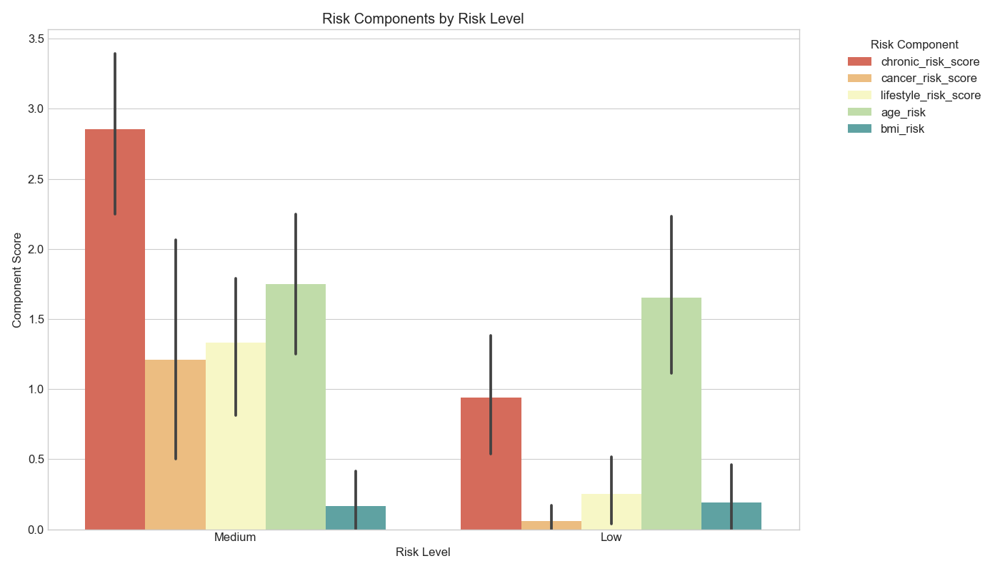

This roadmap outlines our planned improvements with their expected impact and implementation complexity.

## Running the Prediction Pipeline

```bash
# Run the end-to-end prediction pipeline
python main.py

# Run with basic features only
python main.py --basic-features

# Force training a new model
python main.py --force-train

# Skip business report generation
python main.py --no-report

# Run with test data (smaller dataset)
python main.py --test
```

The pipeline performs:
1. Load and preprocess claims and member data
2. Engineer features from the data
3. Train a model or load a previously trained model
4. Make predictions
5. Analyze results and generate visualizations

Prediction results are saved to:
- `outputs/tables/prediction_results.csv`
- `outputs/figures/predictions/`

## Running Tests

```bash
# Run all tests
python run_tests.py

# Run with verbose output
python run_tests.py --verbose

# Run a specific test class
python run_tests.py --test TestPredictionPipeline
```

See [tests/README.md](tests/README.md) for more information on testing.

## Project Components

### Data Components
- `enhanced_data_preparation.py`: Advanced data cleaning and preprocessing
- `enhanced_feature_engineering.py`: Feature creation and transformation

### Feature Engineering Components
- `advanced_temporal_features.py`: Time-based feature extraction
- `enhanced_risk_scores.py`: Risk score calculation based on member attributes

### Modeling Components
- `xgboost_modeling.py`: XGBoost model training and evaluation
- `advanced_modeling.py`: Advanced modeling techniques and hyperparameter optimization

### Analysis Components
- `error_analysis.py`: Prediction error analysis
- `fairness_analysis.py`: Fairness metrics and bias detection
- `explainability.py`: Model explainability using SHAP values

## Recent Updates

### Code Cleanup and Refactoring (2023-04-07)

1. **Consolidated Pipeline**: Multiple overlapping run scripts have been consolidated into a single unified pipeline in `src/run_prediction_pipeline.py`.
2. **Simplified Entry Point**: Added a single entry point script (`main.py`) in the root directory.
3. **Removed Unused Files**: Empty notebook files and redundant scripts have been removed.
4. **Improved Testing**: Added comprehensive tests for the consolidated pipeline in `tests/test_pipeline.py`.

See the CHANGELOG.md for a full list of changes.

## License

This project is licensed under the MIT License - see the LICENSE file for details. 