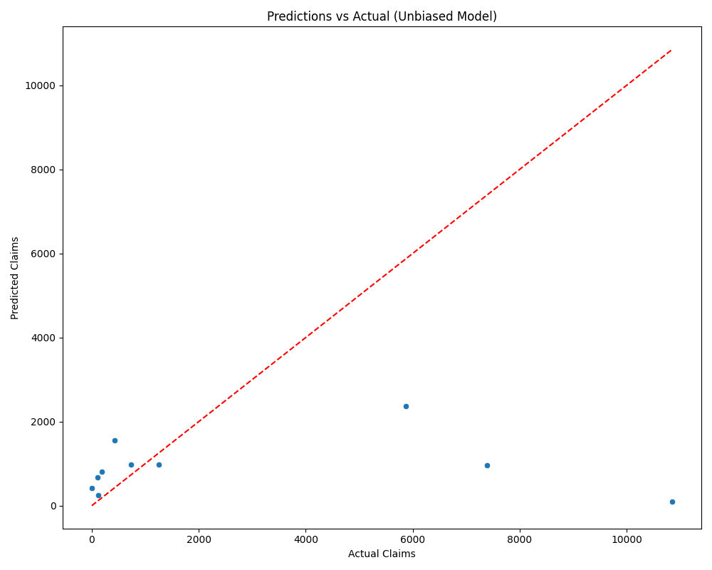
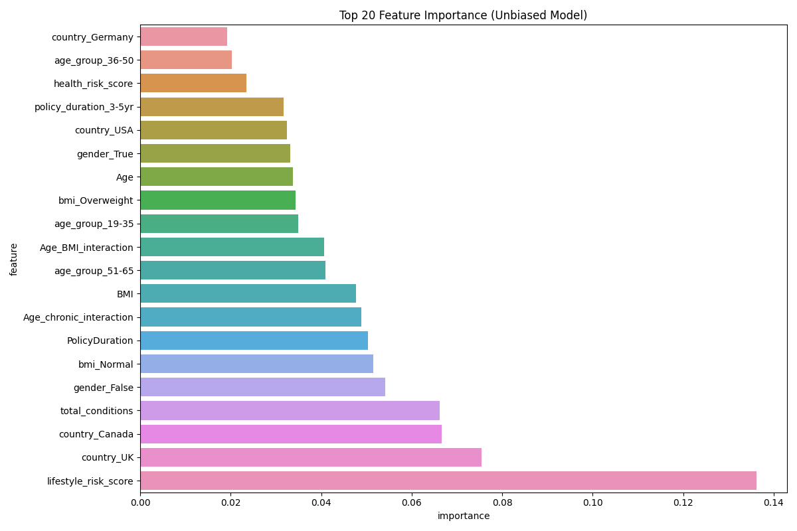
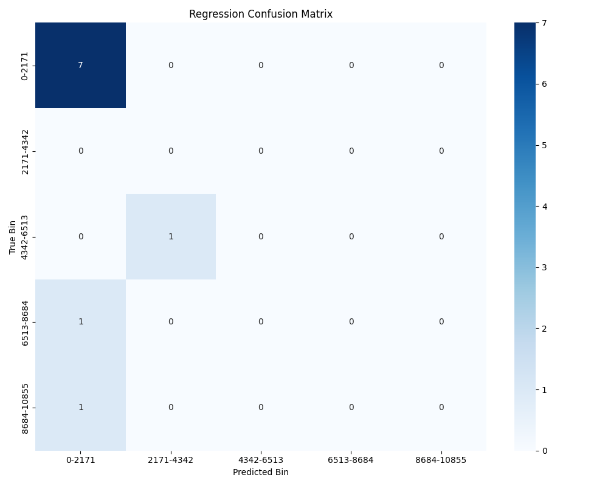

# PassportCard Insurance Claims Prediction

## Project Overview
This project develops predictive models for insurance claims at PassportCard. The analysis focuses on predicting the total claim amount per customer for the next six months using member profiles and optionally claims history. The solution prioritizes unbiased prediction approaches that avoid circular dependencies between features and target variables.

## Key Innovations

### Unbiased Modeling Approach
- **Member-Only Feature Engineering**: Uses only member attributes for predictions, avoiding historical claims data in features
- **Reduced Data Leakage**: Prevents circular reasoning where historical claims predict future claims
- **Isolating True Risk Factors**: Focuses on intrinsic member characteristics that influence claims

### Advanced Data Science Techniques
- **Comprehensive Feature Engineering**: Extracts meaningful features from member demographics, questionnaire responses, and health indicators
- **XGBoost Modeling**: Implements gradient boosting with hyperparameter optimization
- **Thorough Validation**: Implements proper temporal validation to prevent leakage
- **Error Analysis**: Detailed examination of prediction errors to understand model limitations

## Model Performance

### Unbiased Member-Based Model

The unbiased model uses only member attributes and avoids using claim-based features for prediction:

- **RMSE**: 4143.04 USD
- **MAE**: 2406.69 USD
- **R²**: -0.26
- **MAPE**: 41370074463041.58%

#### Top 5 Important Features

| feature              |   importance |
|:---------------------|-------------:|
| lifestyle_risk_score |    0.136139  |
| country_UK           |    0.0754112 |
| country_Canada       |    0.0666563 |
| total_conditions     |    0.0662534 |
| gender_False         |    0.0541064 |

#### Key Findings

- Lifestyle factors and questionnaire responses are strong predictors of future claims
- Country of origin has significant predictive power
- Total health conditions reported by members is a key indicator
- Gender and age also play notable roles in predicting claims
- The negative R² suggests that member-only attributes are insufficient for accurate predictions without claim history

### Visualizations

#### Predictions vs Actual


**Analysis:** This scatter plot compares the model's predictions against actual claim amounts:
- Large dispersion indicates challenges in predicting claim amounts using only member attributes
- Predictions tend to cluster toward the mean, showing limited predictive power
- The unbiased approach reveals the difficulty in predicting claims without historical claims data

#### Feature Importance


**Analysis:** This bar chart shows the top predictive features ranked by importance:
- Lifestyle risk score derived from questionnaire responses is the strongest predictor
- Geographic factors (country of origin) significantly influence claim amounts
- Questionnaire-based health conditions demonstrate predictive value
- Gender and age-related features appear throughout the important features

#### Regression Confusion Matrix


**Analysis:** The regression confusion matrix shows:
- Classification of predictions into value ranges
- Areas where the model most frequently misclassifies claim amounts
- Overall pattern of prediction accuracy across different claim value ranges

## Implementation Details

### Member-Based Feature Engineering

The model extracts the following feature categories from member data:

1. **Demographic Features**:
   - Age and age groups
   - Gender
   - Country of origin

2. **Policy Features**:
   - Policy duration
   - Policy duration categories

3. **Health Indicators**:
   - BMI and BMI categories 
   - Questionnaire-derived health scores

4. **Derived Health Scores**:
   - Chronic condition score
   - Cancer risk score
   - Lifestyle risk score
   - Overall health risk score

5. **Interaction Features**:
   - Age x BMI interaction
   - Age x chronic condition interaction

### Training Strategy
- XGBoost regression with hyperparameter optimization
- Proper temporal validation using 6-month forward cutoff
- Careful feature cleaning to ensure XGBoost compatibility
- Comprehensive error analysis to understand model limitations

## Project Structure
- `member_feature_engineering.py`: Extracts features from member data only
- `run_unbiased_modeling.py`: Pipeline for unbiased modeling approach
- `xgboost_modeling.py`: XGBoost training, evaluation, and feature importance
- `error_analysis.py`: Comprehensive error analysis and visualization tools
- `data_preparation.py`: Data loading and preprocessing

## Usage Instructions

1. Create a virtual environment (recommended):
```bash
python -m venv venv
source venv/bin/activate  # On Windows: venv\Scripts\activate
```

2. Install dependencies:
```bash
pip install -r requirements.txt
```

3. Run the unbiased modeling pipeline:
```bash
python run_unbiased_modeling.py
```

4. The results will be saved to:
   - `visualizations/unbiased_model/`: Contains all plots and visualizations
   - `feature_importance_unbiased.csv`: Feature importance rankings
   - `best_unbiased_model.pkl`: Trained model for deployment
   - `unbiased_model_metrics.txt`: Performance metrics

## Conclusions and Future Work

### Key Takeaways
- Member-only attributes provide some predictive power but are insufficient for accurate predictions
- Lifestyle factors and health indicators from questionnaires are the strongest predictors
- Country of origin and demographic factors have significant influence
- Unbiased modeling reveals the inherent challenge in insurance claim prediction without claims history

### Future Improvements
- Collect more detailed member health data to improve prediction accuracy
- Develop hybrid models that balance historical claims with member attributes
- Explore more sophisticated feature interactions
- Implement specialized models for different claim types or service categories
- Integrate external data sources (e.g., geographic health trends)

## License
This project is proprietary and confidential. All rights reserved. 