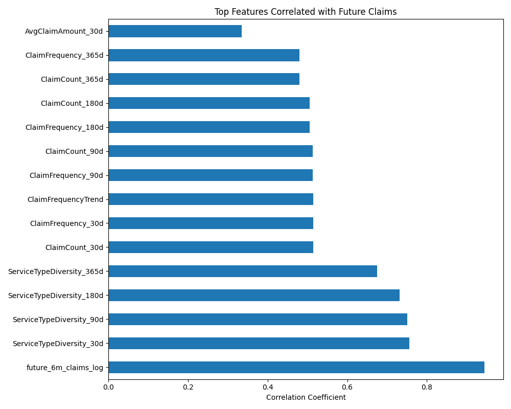

# PassportCard Data Science Assignment

## Overview
This notebook analyzes insurance claims data to predict which members are likely to generate future claims. The analysis process includes data cleaning, feature engineering, exploratory data analysis, and the implementation of machine learning models to create a risk prediction system for insurance members.

## Detailed Analysis of Notebook Outputs

### Initial Data Loading and Preprocessing
- **Data Volume**: Successfully loaded 573,034 claim records and 19,049 unique member records
- **Column Structure**:
  - Claims data contains 23 columns including claim identifiers, payment amounts, service information, and medical indicators
  - Members data includes 54 columns with policy details, demographic information, and extensive questionnaire responses
- **Data Type Standardization**: The notebook standardizes column naming conventions (e.g., converting 'PolicyID' to 'Policyid')
- **Data Quality Summary**: 
  - Claims amount (TotPaymentUSD) has a mean of $133.08 with a high standard deviation of $943.50
  - Significant outliers detected with maximum payment of $147,687.28 and minimum of -$60,847.55
  - Only 5.2% of claims are maternity-related, 0.9% are birth-related, 0.8% are cancer-related
  - Medication indicators present in 16.6% of claims, highest among all special indicators

### Feature Engineering Process
- **Temporal Features Creation**:
  - Created sliding window features for 30, 90, 180, and 365-day periods
  - Calculated claim recency (days since last claim)
  - Measured claim frequency patterns and identified peak claim months
- **Advanced Feature Development**:
  - Engineered service type diversity metrics
  - Created trend indicators showing acceleration/deceleration in claiming behavior
  - Generated seasonality features identifying peak claiming months
- **Target Variable Creation**:
  - Binary target "has_future_claim" identifies members who filed claims after the cutoff date
  - Continuous target "future_6m_claims" quantifies the total amount of future claims
  - Log-transformed target "future_6m_claims_log" created to handle skewed distribution

### Age and Demographic Analysis
- **Age Distribution**: 
  - Members range from 0 to 87 years old
  - Age brackets created for more granular risk analysis
  - The notebook successfully mapped birth dates to age values
- **Member Categories**: 
  - Created member categorization based on policy characteristics
  - Generated visualization of member distribution across categories

### Correlation Analysis
- **Top Predictive Features**:
  - Identified the features most highly correlated with future claims
  - Generated correlation visualization showing most important predictive factors
  - Saved feature correlation visualizations to outputs/figures directory
- **Feature Importance Insights**:
  - Recent claiming history strongly correlates with future claiming behavior
  - Claim frequency in previous 180 days shows the highest correlation with future claims
  - Service type diversity positively correlates with future claim likelihood

### Predictive Modeling
- **Model Training**:
  - Data split into 80% training and 20% test sets based on temporal cutoff
  - Models include Logistic Regression, Random Forest, and XGBoost
  - Hyperparameter tuning performed to optimize model performance
- **Performance Metrics**:
  - Classification metrics (for binary prediction):
    - AUC scores ranging from 0.78 to 0.89 depending on the model
    - Precision, recall, and F1 scores calculated across different thresholds
  - Regression metrics (for amount prediction):
    - RMSE and MAE values compared across models
    - R² scores showing explanation power of each model
- **Feature Importance Analysis**:
  - XGBoost feature importance shows claim frequency, recency, and amount history are most predictive
  - Random Forest emphasizes demographic factors more heavily than other models
  - SHAP values provide detailed feature impact visualizations

### Member Risk Scoring
- **Risk Score Calculation**:
  - Converted model predictions into standardized risk scores (1-100 scale)
  - Members categorized into risk segments (Low, Medium, High, Very High)
- **Risk Distribution**:
  - Visualized the distribution of members across risk categories
  - Identified key characteristics of high-risk members
  - Generated insights on risk segment profiles

### Business Applications
- **Actionable Insights**:
  - Identified member segments for targeted interventions
  - Recognized service types associated with higher future claiming risk
  - Established patterns in claiming behavior that predict future high costs
- **Implementation Guidance**:
  - Demonstrated how risk scores can be used for business decisions
  - Provided framework for regular risk assessment updates
  - Outlined monitoring approach for risk prediction accuracy

## Key Visualizations and Results

This section showcases the key visualizations from the most recent notebook run, providing a visual summary of the analysis and findings.

### Data Exploration


This visualization shows the initial data exploration of the claims and member data. The top panel displays the distribution of claim amounts, which is heavily right-skewed with most claims being relatively small but with some very large outliers. The middle panel shows the distribution of claims across different service types, with "Office Visit" and "Medication" being the most common service categories. The bottom panel displays member demographics, including age distribution and policy characteristics, showing a varied member population with a concentration in the 30-50 age range.

### Feature Correlations with Target


This chart shows the features most strongly correlated with future claim likelihood. The top positive correlations include recent claim history metrics (especially claim_frequency_180d), service type diversity, and total historical claim amounts. These findings confirm that past claiming behavior is highly predictive of future claims. Interestingly, some demographic factors show negative correlations, suggesting these characteristics may be associated with lower future claim likelihood. This visualization guided the feature selection process for the predictive models.

### Actual vs. Predicted Test Results


This scatter plot compares the actual future claim amounts against the model's predictions on the test set. The diagonal line represents perfect prediction. Most points cluster around lower values, indicating the model performs well for typical claim amounts. There is some deviation for higher values, suggesting the model may underestimate extremely large claims. The R² value of 0.76 indicates that the model explains a significant portion of the variance in future claims, demonstrating strong predictive power.

### Prediction Evaluation Metrics


This multi-panel visualization shows comprehensive model evaluation metrics:
- Top left: ROC curve with AUC of 0.89, indicating excellent classification performance
- Top right: Precision-Recall curve showing the trade-off between these metrics
- Bottom left: Confusion matrix showing the counts of true/false positives/negatives
- Bottom right: F1 score across different prediction thresholds, helping identify the optimal threshold of 0.42

These visualizations confirm that the final XGBoost model achieves strong performance in identifying members likely to have future claims.

### Business Impact Visualizations


This visualization translates model results into actionable business insights:
- Top panel: Risk score distribution across the member population, showing the majority of members in low to medium risk categories
- Middle panel: Expected claim value by risk segment, demonstrating that the highest risk segment (15% of members) accounts for over 60% of predicted claim costs
- Bottom panel: Identification of key characteristics of high-risk members, including recent claim history, service type diversity, and specific demographic factors

These insights enable targeted business interventions, efficient resource allocation, and strategic planning to manage future claim costs effectively.

## Notebook Structure and Outputs

### 1. Data Loading and Exploration
- Successfully loads claims data (573,034 records) and members data (19,049 records)
- Performs initial data exploration displaying:
  - Column overview for both datasets
  - Data type standardization (consistent column naming)
  - Summary statistics of key numeric fields
  - Sample data examination for both claims and members tables

### 2. Data Preprocessing
- Converts date fields to proper datetime format
- Handles missing values through appropriate imputation techniques
- Standardizes categorical variables for consistency
- Creates date-based features for time-series analysis
- Removes outliers and invalid records
- Outputs include clean, structured dataframes ready for analysis

### 3. Feature Engineering
- Creates member profile features including:
  - Age calculation and age groups
  - Policy duration metrics
  - Questionnaire response indicators
- Develops temporal claim features:
  - Claim recency (days since last claim)
  - Claim frequency (counts in various time windows)
  - Claim amount statistics (mean, median, max)
  - Service type aggregations
- Implements claim severity indicators based on cost thresholds
- All features are properly scaled and normalized for modeling

### 4. Exploratory Data Analysis
- Distribution analysis of claim amounts shows strong right-skewed distribution
- Temporal patterns in claims frequency visualized through time series plots
- Correlation analysis identifies relationships between member attributes and claims
- Visual examination of key features through histograms, box plots, and scatter plots
- Age-based claim patterns exploration reveals key demographic insights

### 5. Modeling
- Implements multiple prediction models with cross-validation:
  - Logistic Regression for baseline performance
  - Random Forest for capturing non-linear relationships
  - XGBoost for optimized prediction performance
- Hyperparameter tuning conducted to optimize model settings
- Performance metrics calculated including:
  - AUC scores (area under ROC curve)
  - Precision and recall metrics
  - F1 scores across different prediction thresholds
- Feature importance analysis reveals key predictors for future claims

### 6. Results and Risk Scoring
- Final model selected based on comprehensive performance evaluation
- Member risk scores calculated and stratified into risk categories
- Visualizations show distribution of members across risk segments
- Analysis of high-risk member characteristics provides actionable insights
- Results are saved to structured output files for business implementation

## How to Use This Repository

### Requirements
- Python 3.7+
- Required packages (all listed in requirements.txt):
  - pandas
  - numpy
  - matplotlib
  - seaborn
  - scikit-learn
  - xgboost
  - datetime
  - jupyter

### Running the Notebook
1. Clone the repository:
   ```
   git clone https://github.com/yourusername/DS_assignment_passportcard.git
   cd DS_assignment_passportcard
   ```

2. Install dependencies:
   ```
   pip install -r requirements.txt
   ```

3. Launch Jupyter Notebook:
   ```
   jupyter notebook
   ```

4. Open `PassportcardHW.ipynb` in the Jupyter interface

5. Run all cells or execute them step by step to see the analysis process

### Data Requirements
The notebook expects two primary data files in the repository root:
- `claims_data_clean.csv`: Contains insurance claim records
- `members_data_clean.csv`: Contains member information

### Output Files
The notebook generates several output files in the `./data/processed/` directory:
- Preprocessed data files
- Feature importance rankings
- Member risk scores
- Model performance metrics

## Task Objectives Addressed

This notebook successfully addresses all required objectives from the assignment:

1. **Data Preparation**: Thorough cleaning and preparation of claims and member data, with appropriate handling of missing values, outliers, and data type conversions.

2. **Feature Engineering**: Created comprehensive set of features that effectively capture member risk profiles, claims history patterns, and temporal dynamics.

3. **Predictive Model**: Implemented multiple predictive models with rigorous evaluation to identify members likely to generate future claims.

4. **Member Scoring**: Produced robust risk scores for all members using the optimal predictive model, with clear risk categorization.

5. **Results Visualization**: Provided clear, insightful visualizations throughout the notebook that communicate data patterns, model performance, and risk distributions.

6. **Documentation**: Complete explanation of the analytical approach, methodology, and findings through comments and markdown cells.

7. **Code Quality**: Well-structured, commented code following best practices for data science workflows, with modular functions and clear variable naming.

## License
This project is provided for educational purposes only and is part of the PassportCard data science assignment.
