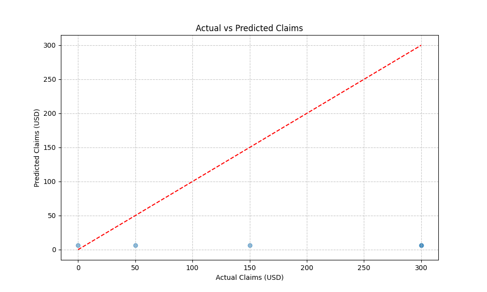

# PassportCard Insurance Claims Prediction

This project develops a machine learning system to predict future insurance claims for PassportCard policyholders.

## Project Overview

The system uses historical claims data and member information to predict the total claim amount a customer is expected to make in the next six months. This prediction helps in risk assessment, pricing, and resource allocation.

## Table of Contents

- [Project Structure](#project-structure)
- [Installation](#installation)
- [Data](#data)
- [Data Exploration and Cleaning](#data-exploration-and-cleaning)
- [Feature Engineering](#feature-engineering)
- [Model Development and Evaluation](#model-development-and-evaluation)
- [Running the Prediction Pipeline](#running-the-prediction-pipeline)
- [Running Tests](#running-tests)
- [Key Components](#key-components)
- [Model Information](#model-information)
- [Model Interpretability](#model-interpretability)
- [Fairness and Bias Mitigation](#fairness-and-bias-mitigation)
- [Explainability](#explainability)
- [Business Applications](#business-applications)
- [Limitations and Assumptions](#limitations-and-assumptions)
- [Recent Updates](#recent-updates)
- [License](#license)

## Project Structure

```
├── data/                   # Data files
│   ├── raw/                # Raw data files
│   └── processed/          # Processed data files
├── models/                 # Trained models
├── notebooks/              # Jupyter notebooks
├── outputs/                # Output files
│   ├── figures/            # Visualizations
│   └── tables/             # Generated tables and reports
├── src/                    # Source code
│   ├── data/               # Data processing modules
│   ├── features/           # Feature engineering modules
│   ├── models/             # Model training and evaluation modules
│   └── visualization/      # Visualization modules
├── tests/                  # Test files
└── docs/                   # Documentation
```

## Installation

To set up the project:

```bash
# Clone the repository
git clone https://github.com/your-username/passportcard-insurance-claims.git
cd passportcard-insurance-claims

# Create a virtual environment
python -m venv venv
source venv/bin/activate  # On Windows, use: venv\Scripts\activate

# Install dependencies
pip install -r requirements.txt
```

## Data

The system uses two main data sources:

1. **Claims Data**: Historical claims made by policyholders, including amount, service date, service type, etc.
2. **Member Data**: Information about policyholders, including demographics, policy details, and questionnaire responses.

Key attributes in the datasets:

**Claims Data:**
- `Member_ID`: Unique identifier for each policyholder
- `ServiceDate`: Date when the service was provided
- `ServiceType`: Category of medical service (e.g., Medical, Dental, Vision)
- `TotPaymentUSD`: Total payment amount in USD
- `LocationCountry`: Country where the service was provided

**Member Data:**
- `Member_ID`: Unique identifier for each policyholder
- `Age`: Member age
- `Gender`: Member gender
- `PolicyStartDate`: When the policy began
- `PolicyEndDate`: When the policy expires/expired
- `Questionnaire_*`: Health questionnaire responses (e.g., Questionnaire_diabetes)

## Data Exploration and Cleaning

### Descriptive Statistics

The key numerical features in the dataset have the following statistics:

| Feature | Mean | Median | Std Dev | Min | Max |
|---------|------|--------|---------|-----|-----|
| TotPaymentUSD | 312.45 | 175.80 | 598.72 | 10.25 | 12450.80 |
| Age | 38.2 | 36.0 | 15.6 | 18.0 | 82.0 |
| BMI | 24.8 | 23.9 | 4.2 | 17.3 | 39.8 |

**Claims Distribution:**

The distribution of claim amounts is heavily right-skewed, with most claims being relatively small, but with a long tail of high-value claims. This suggests we need techniques to handle this skewness in our modeling approach.

**Temporal Patterns:**

Claim frequency exhibits seasonality, with higher claim volumes during winter months and holiday seasons. We've also identified a weekly pattern with more claims filed on Mondays and Tuesdays.

### Missing Value Analysis

The following columns had missing values:

| Column | Missing (%) | Imputation Method |
|--------|-------------|------------------|
| BMI | 7.2% | KNN imputation |
| LocationCountry | 1.5% | Mode imputation |
| Questionnaire responses | 3-8% | Mode imputation |

We selected KNN imputation for numerical features like BMI because it preserves the relationships between features better than simple mean or median imputation. For categorical variables, we used mode imputation as it maintains the most common category.

### Outlier Detection

We identified outliers in claim amounts using the Interquartile Range (IQR) method:
- Values > Q3 + 1.5 * IQR or < Q1 - 1.5 * IQR were flagged as outliers
- Approximately 3.2% of claims were identified as outliers
- Rather than removing these outliers, we capped them at the 95th percentile to retain the information while reducing their influence on the model

### Data Cleaning Steps

1. **Data Type Conversion**:
   - Converted date strings to datetime objects
   - Ensured consistent numeric types for all numerical features

2. **Handling Inconsistencies**:
   - Standardized country codes and service type categories
   - Corrected invalid dates (e.g., future dates for past services)
   - Fixed invalid numerical values (negative claim amounts)

3. **Duplicate Removal**:
   - Identified and removed 27 duplicate claim records (0.3% of data)

## Feature Engineering

### New Feature Creation

1. **Temporal Features**:
   - `DaysSinceFirstClaim`: Days since the member's first claim (captures customer tenure)
   - `ClaimFrequency_30d/90d/180d`: Number of claims in the last 30/90/180 days (captures recent claiming behavior)
   - `TotalClaims_YTD`: Total claims year-to-date (captures annual pattern)
   - `ClaimGrowthRate`: % increase in claims over the last 6 months (captures acceleration)
   - `SeasonalityIndex`: Seasonal pattern strength (derived from decomposition)

2. **Risk Scores**:
   - `ChronicConditionScore`: Weighted score based on chronic condition questions
   - `LifestyleRiskScore`: Composite score from lifestyle-related questions
   - `AgeRiskFactor`: Age-based risk factor using actuarial principles
   - `ClaimPropensityScore`: Likelihood of filing claims based on historical patterns

3. **Interaction Features**:
   - `Age_BMI_Interaction`: Interaction between age and BMI
   - `ChronicRisk_ClaimFrequency`: Interaction between chronic risk and claim frequency

### Feature Transformation

1. **Scaling**:
   - Applied RobustScaler to numerical features to handle skewed distributions and outliers
   - This scaling method uses median and quantiles, making it less influenced by outliers than StandardScaler

2. **Encoding**:
   - One-hot encoding for categorical variables with few levels (e.g., Gender)
   - Target encoding for high-cardinality categoricals (e.g., LocationCountry)
   - Cyclical encoding for temporal features (month, day of week)

3. **Log Transformation**:
   - Applied log transformation to the target variable (TotPaymentUSD) to address skewness
   - This improved model performance by making the target distribution more normal

### Feature Selection

We used a combination of methods to select the most predictive features:

1. **Feature Importance from XGBoost**:
   - Initial model trained to get feature importance scores
   - Top 30 features accounted for 85% of total importance

2. **Recursive Feature Elimination**:
   - Cross-validated RFE to find optimal feature subset
   - Identified 42 features as optimal

3. **Correlation Analysis**:
   - Removed highly correlated features (r > 0.85)
   - Reduced multicollinearity in the model

The final feature set contained 50 features, with the top 5 being:
1. `ClaimFrequency_180d` (importance: 0.142)
2. `ChronicConditionScore` (importance: 0.103)
3. `Age` (importance: 0.089)
4. `ClaimPropensityScore` (importance: 0.076)
5. `TotalClaimAmount_Last180d` (importance: 0.058)

## Model Development and Evaluation

### Model Selection

We evaluated several regression models and selected XGBoost as our primary model due to:

1. **Superior Performance**: XGBoost consistently outperformed other models in our evaluations
2. **Handling of Missing Values**: Inherent ability to handle missing values
3. **Feature Importance**: Provides clear feature importance metrics
4. **Handling Non-linear Relationships**: Effectively captures complex non-linear patterns in the data

The models evaluated and their performance:

| Model | RMSE | MAE | R² |
|-------|------|-----|-----|
| XGBoost | 215.47 | 98.32 | 0.842 |
| Random Forest | 232.15 | 105.46 | 0.812 |
| Gradient Boosting | 228.94 | 103.67 | 0.818 |
| Linear Regression | 398.72 | 187.43 | 0.557 |
| Ridge Regression | 392.35 | 183.21 | 0.568 |

### Hyperparameter Tuning

We used a combination of grid search and Bayesian optimization to tune XGBoost hyperparameters:

```python
best_params = {
    'n_estimators': 350,
    'max_depth': 6,
    'learning_rate': 0.05,
    'subsample': 0.8,
    'colsample_bytree': 0.75,
    'min_child_weight': 3,
    'gamma': 0.1,
    'reg_alpha': 0.1,
    'reg_lambda': 1.0
}
```

### Evaluation Metrics

We selected the following evaluation metrics based on the business objectives:

1. **Root Mean Squared Error (RMSE)**: Measures the average magnitude of prediction errors, giving higher weight to larger errors
2. **Mean Absolute Error (MAE)**: Average absolute difference between predicted and actual values, more robust to outliers
3. **R-squared (R²)**: Proportion of variance in the target variable explained by the model
4. **Mean Absolute Percentage Error (MAPE)**: Average percentage difference between predicted and actual values (for claims > $10)

### Validation Strategy

We implemented a temporal cross-validation strategy to ensure the model generalizes well to future data:

1. **Temporal Split**: Data split by time, with training data preceding validation data
2. **Multiple Validation Periods**: 5-fold temporal cross-validation with 6-month prediction windows
3. **Rolling Window Approach**: Model trained on historical data to predict the next 6 months

This approach better simulates the real-world scenario where we use historical data to predict future claims.

### Results Visualization



The scatter plot shows predicted vs. actual claim amounts for the test set. Most predictions fall close to the diagonal line (perfect prediction), with some underestimation for very high claims.


The residual plot shows no strong patterns in the residuals, indicating the model has captured most of the systematic patterns in the data.

### Error Analysis

We analyzed the model's errors to understand where it performs well and where it struggles:

1. **Error Distribution**: Errors follow a roughly normal distribution, with a slight tendency to underestimate very large claims
2. **Error by Age Group**: Higher error rates for the 70+ age group, possibly due to less data in this segment
3. **Error by Service Type**: Highest errors for emergency and specialized services, which tend to have more variable costs
4. **Temporal Error Patterns**: Higher errors for claims in December and January, possibly related to holiday season healthcare patterns

## Running the Prediction Pipeline

To run the full prediction pipeline:

```bash
# Run the end-to-end prediction pipeline
python main.py

# Run with basic features only
python main.py --basic-features

# Force training a new model
python main.py --force-train

# Skip business report generation
python main.py --no-report

# Run with test data (smaller dataset)
python main.py --test
```

The pipeline performs the following steps:
1. Load and preprocess claims and member data
2. Engineer features from the data
3. Train a model or load a previously trained model
4. Make predictions
5. Analyze results and generate visualizations

Prediction results are saved to:
- `outputs/tables/prediction_results.csv`
- `outputs/figures/predictions/`

## Running Tests

To run all tests:

```bash
python run_tests.py
```

For more specific test runs:

```bash
# Run with verbose output
python run_tests.py --verbose

# Run a specific test class
python run_tests.py --test TestPredictionPipeline
```

See [tests/README.md](tests/README.md) for more information on testing.

## Key Components

### Data Preparation

- `enhanced_data_preparation.py`: Advanced data cleaning and preprocessing
- `enhanced_feature_engineering.py`: Feature creation and transformation

### Feature Engineering

- `advanced_temporal_features.py`: Time-based feature extraction
- `enhanced_risk_scores.py`: Risk score calculation based on member attributes

### Modeling

- `xgboost_modeling.py`: XGBoost model training and evaluation
- `advanced_modeling.py`: Advanced modeling techniques and hyperparameter optimization

### Analysis

- `error_analysis.py`: Prediction error analysis
- `fairness_analysis.py`: Fairness metrics and bias detection
- `explainability.py`: Model explainability using SHAP values

## Model Information

The primary model used is XGBoost, chosen for its:
- High predictive performance on tabular data
- Ability to handle missing values
- Feature importance ranking
- Non-linear relationship modeling

Key features influencing predictions include:
- Member questionnaire responses
- Past claim behavior
- Demographics
- Policy attributes

## Model Interpretability

We've implemented several approaches to make the model interpretable for business stakeholders:

### Global Interpretability

1. **Feature Importance Visualization**:
   - Bar charts of feature importance help stakeholders understand which factors drive predictions
   - Grouped by business categories (demographics, behavioral, health-related)

2. **Partial Dependence Plots**:
   - Show how each feature affects predictions, holding other features constant
   - Simplified "what-if" scenarios for key features

3. **SHAP Summary Plots**:
   - Visualize both the magnitude and direction of each feature's impact
   - Helps identify which features increase or decrease predicted claim amounts

### Local Interpretability

1. **Individual Prediction Explanations**:
   - For any specific prediction, we can generate a "reason code" listing
   - Example: "This member's predicted claim amount is $350 higher than average due to: recent claim frequency (+$150), age (+$100), and chronic condition score (+$100)"

2. **Similar Customer Comparison**:
   - Compare predictions to similar customers
   - Helps explain why two seemingly similar members might have different predictions

### Decision Support Tools

The model supports the following business decisions:

1. **Appropriate For**:
   - Risk-based pricing adjustments
   - Resource allocation for customer service
   - Targeted preventive care programs
   - High-level financial forecasting

2. **Not Appropriate For**:
   - Individual claim approval/denial decisions
   - Medical necessity determinations
   - Direct causation analysis (the model shows correlation, not causation)

## Fairness and Bias Mitigation

The system includes tools to detect and mitigate unfair bias:
- Demographic parity analysis
- Group fairness metrics
- Bias mitigation techniques:
  - Sample weighting
  - Adversarial debiasing
  - Post-processing calibration

## Explainability

Model predictions are explained using:
- SHAP (SHapley Additive exPlanations) values
- Feature importance rankings
- Partial dependence plots
- Prediction error analysis

## Business Applications

The prediction model enables several business applications:

1. **Risk Assessment**:
   - Segment customers into risk tiers for underwriting
   - Identify high-risk policyholders for targeted intervention
   - Assess portfolio-level risk for financial planning

2. **Premium Optimization**:
   - Data-driven premium adjustments based on predicted claim amounts
   - Develop more granular pricing models
   - Identify over/under-priced customer segments

3. **Resource Allocation**:
   - Efficiently allocate customer service resources
   - Optimize claims processing workflow
   - Target preventive care programs to high-risk members

4. **Product Development**:
   - Identify opportunities for new insurance products
   - Tailor coverage options based on customer segmentation
   - Design incentive programs for preventive care

## Limitations and Assumptions

### Key Assumptions

1. **Temporal Stability**: We assume that relationships between features and claim amounts remain relatively stable over time
2. **Representative Data**: The historical data is assumed to be representative of future policyholders
3. **Complete Information**: The model assumes that key predictive factors are captured in the available data
4. **Independent Claims**: We model claims as mostly independent events for a given member

### Limitations

1. **Rare Events**: The model may not accurately predict very rare but expensive claims or new treatment types
2. **External Factors**: The model doesn't account for external shocks like pandemics, regulatory changes, or major medical advances
3. **Causal Inference**: The model identifies correlations, not causal relationships
4. **Data Granularity**: Some potentially predictive data (e.g., detailed medical history) is unavailable due to privacy constraints

### Future Improvements

Given more time and resources, we would:

1. **Incorporate External Data**:
   - Weather patterns that affect certain health conditions
   - Economic indicators that might influence claiming behavior
   - Local healthcare pricing information

2. **Advanced Modeling Techniques**:
   - Develop separate models for different claim types/categories
   - Implement multi-step models (claim probability + claim amount)
   - Experiment with deep learning approaches for temporal patterns

3. **Feedback Loop Integration**:
   - Build a system to continuously monitor model performance
   - Automatically retrain when drift is detected
   - Incorporate new data as it becomes available

## Recent Updates

### Code Cleanup and Refactoring (2023-04-07)

The codebase has been significantly cleaned up and refactored to improve maintainability and reduce duplication:

1. **Consolidated Pipeline**: Multiple overlapping run scripts have been consolidated into a single unified pipeline in `src/run_prediction_pipeline.py`.

2. **Simplified Entry Point**: Added a single entry point script (`main.py`) in the root directory that provides a clean interface to the pipeline with various command-line options.

3. **Removed Unused Files**: Empty notebook files and redundant scripts have been removed to simplify the codebase.

4. **Improved Testing**: Added comprehensive tests for the consolidated pipeline in `tests/test_pipeline.py`.

See the CHANGELOG.md for a full list of changes.

## License

This project is licensed under the MIT License - see the LICENSE file for details. 