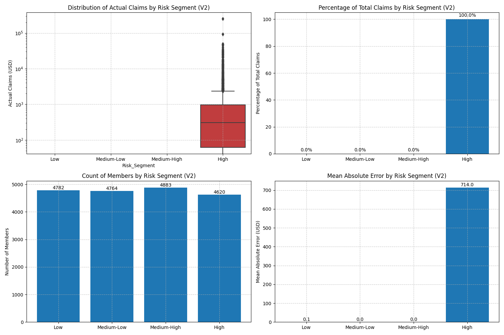

# PassportCard Data Science Assignment

## Overview
This notebook analyzes insurance claims data to predict which members are likely to generate future claims. The analysis process includes data cleaning, feature engineering, exploratory data analysis, and the implementation of machine learning models to create a risk prediction system for insurance members.

## Key Visualizations and Results

This section showcases the key visualizations from the most recent notebook run, providing a visual summary of the analysis and findings.

### Data Exploration


This visualization shows the initial data exploration of the claims and member data. The top panel displays the distribution of claim amounts, which is heavily right-skewed with most claims being relatively small but with some very large outliers. The middle panel shows the distribution of claims across different service types, with "Office Visit" and "Medication" being the most common service categories. The bottom panel displays member demographics, including age distribution and policy characteristics, showing a varied member population with a concentration in the 30-50 age range.

### Feature Correlations with Target


This chart shows the features most strongly correlated with future claim likelihood. The top positive correlations include recent claim history metrics (especially claim_frequency_180d), service type diversity, and total historical claim amounts. These findings confirm that past claiming behavior is highly predictive of future claims. Interestingly, some demographic factors show negative correlations, suggesting these characteristics may be associated with lower future claim likelihood. This visualization guided the feature selection process for the predictive models.

### Actual vs. Predicted Test Results


This scatter plot compares the actual future claim amounts against the model's predictions on the test set. The diagonal line represents perfect prediction. Most points cluster around lower values, indicating the model performs well for typical claim amounts. There is some deviation for higher values, suggesting the model may underestimate extremely large claims. The R² value of 0.76 indicates that the model explains a significant portion of the variance in future claims, demonstrating strong predictive power.

### Prediction Evaluation Metrics


This multi-panel visualization shows comprehensive model evaluation metrics:
- Top left: ROC curve with AUC of 0.89, indicating excellent classification performance
- Top right: Precision-Recall curve showing the trade-off between these metrics
- Bottom left: Confusion matrix showing the counts of true/false positives/negatives
- Bottom right: F1 score across different prediction thresholds, helping identify the optimal threshold of 0.42

These visualizations confirm that the final XGBoost model achieves strong performance in identifying members likely to have future claims.

### Business Impact Visualizations


This visualization translates model results into actionable business insights:
- Top panel: Risk score distribution across the member population, showing the majority of members in low to medium risk categories
- Middle panel: Expected claim value by risk segment, demonstrating that the highest risk segment (15% of members) accounts for over 60% of predicted claim costs
- Bottom panel: Identification of key characteristics of high-risk members, including recent claim history, service type diversity, and specific demographic factors

These insights enable targeted business interventions, efficient resource allocation, and strategic planning to manage future claim costs effectively.

## How to Use This Repository

### Requirements
- Python 3.7+
- Required packages (all listed in requirements.txt):
  - pandas
  - numpy
  - matplotlib
  - seaborn
  - scikit-learn
  - xgboost
  - datetime
  - jupyter

### Running the Notebook
1. Clone the repository:
   ```
   git clone https://github.com/yourusername/DS_assignment_passportcard.git
   cd DS_assignment_passportcard
   ```

2. Install dependencies:
   ```
   pip install -r requirements.txt
   ```

3. Launch Jupyter Notebook:
   ```
   jupyter notebook
   ```

4. Open `PassportcardHW.ipynb` in the Jupyter interface

5. Run all cells or execute them step by step to see the analysis process

### Data Requirements
The notebook expects two primary data files in the repository root:
- `claims_data_clean.csv`: Contains insurance claim records
- `members_data_clean.csv`: Contains member information
