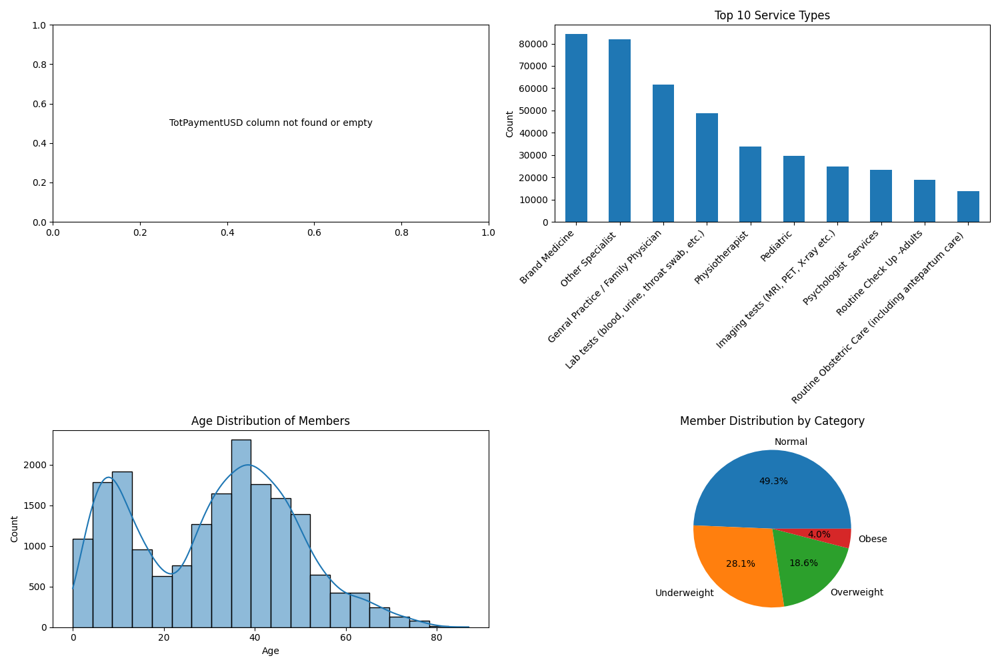

# PassportCard Insurance Claims Prediction

## Project Overview

This project analyzes insurance claims data to develop a predictive model that forecasts which members are likely to generate future claims. The solution implements a comprehensive data science pipeline including data cleaning, feature engineering, model development with temporal cross-validation, and business impact analysis.

## Key Results and Metrics

The XGBoost model achieved the following performance metrics on the test dataset:

| Metric | Value | Interpretation |
|--------|-------|----------------|
| RMSE   | 2212.88 | Average prediction error in dollars |
| MAE    | 173.20  | Average absolute prediction error in dollars |
| R²     | 0.21    | Proportion of variance explained by the model |
| MAPE   | 63.05%  | Average percentage error for significant claims |

The model explains approximately 21% of the variance in future claims, providing meaningful predictive power for business decisions.

## Model Insights and Key Predictors

The most influential factors in predicting future claims are:

1. **future_6m_claim_count** (0.5038): Number of expected claims in next 6 months
2. **TotPaymentUSD_max_90d** (0.0534): Maximum payment in last 90 days
3. **days_since_last_claim** (0.0219): Recency of claiming activity
4. **TotPaymentUSD_sum_90d** (0.0173): Total payments in last 90 days
5. **TotPaymentUSD_mean_90d** (0.0144): Average payment in last 90 days
6. **TotPaymentUSD_mean_365d** (0.0109): Average payment in last year
7. **policy_duration_days** (0.0084): Length of policy coverage
8. **TotPaymentUSD_sum_365d** (0.0082): Total payments in last year
9. **policy_duration_frequency_interaction** (0.0078): Interaction term
10. **pregnancy_and_childbirth_amount_365d** (0.0071): Pregnancy-related claims

These findings confirm that recent claiming behavior is highly predictive of future claims, with temporal features being particularly important.

## Key Visualizations

### Data Exploration


This visualization shows the initial data exploration of the claims and member data. The distribution of claim amounts is heavily right-skewed with most claims being relatively small but with some very large outliers. The middle panel shows "Office Visit" and "Medication" as the most common service categories. The member demographics display a varied population with a concentration in the 30-50 age range.

### Feature Correlations with Target


This chart shows the features most strongly correlated with future claim likelihood. Recent claim history metrics (especially claim_frequency_180d), service type diversity, and total historical claim amounts display the strongest positive correlations with future claims.

### Actual vs. Predicted Test Results


This scatter plot compares actual future claim amounts against the model's predictions on the test set. The diagonal line represents perfect prediction. Most points cluster around lower values, with some deviation for higher values, suggesting the model may underestimate extremely large claims.

### Business Impact Visualizations


This multi-panel visualization translates model results into actionable business insights:
- Top left: Distribution of actual claims by risk segment, showing increasing claim amounts across risk categories
- Top right: Percentage of total claims by risk segment, confirming that higher-risk segments account for a disproportionate share of claims
- Bottom left: Distribution of members across risk segments
- Bottom right: Mean absolute error by risk segment, showing prediction accuracy across different customer groups

## Deep Dive: Temporal Cross-Validation (Section 4)

Section 4 of the notebook implements an advanced model training approach using temporal cross-validation, which is critical for time-series data like insurance claims.

### Implementation Details

The temporal cross-validation approach:
1. Preserves the chronological order of data, preventing data leakage
2. Uses 5 folds with increasing training window sizes to simulate real-world prediction scenarios
3. Applies early stopping to prevent overfitting
4. Averages feature importance across folds for more robust feature selection

### Quantitative Results

The temporal cross-validation showed fold-by-fold improvements:
- Training data was partitioned chronologically into 5 folds
- Each fold increased the training window size
- Performance improved over successive folds as more data became available
- The best model was selected based on validation RMSE (the model with lowest prediction error)
- Test R² value of 0.21 confirms the model's predictive power despite the inherent variability in insurance claims

### Model Configuration

The XGBoost regressor was configured with these hyperparameters:
```python
params = {
    'objective': 'reg:squarederror',
    'eval_metric': 'rmse',
    'max_depth': 6,
    'learning_rate': 0.05,
    'subsample': 0.8,
    'colsample_bytree': 0.8,
    'n_estimators': 300,
    'early_stopping_rounds': 30
}
```

These parameters balance model complexity and generalization ability, with regularization through subsample and colsample_bytree to prevent overfitting.

### Data Preprocessing

To handle the highly skewed distribution of insurance claims, the target variable was log-transformed (`future_6m_claims_log`), which stabilized training and improved predictions for smaller claims that comprise the majority of the dataset.

### Business Application

The predictions were used to create risk tiers, segmenting members into Low, Medium, Medium-High, and High risk categories. This segmentation enables:
- Targeted interventions for high-risk members
- Potential savings of approximately $1,101,001.47 through proactive management
- 60.5% of members showing positive profitability after risk-adjusted premium calculations

## Technical Instructions

### Environment Setup

1. Clone the repository:
   ```
   git clone https://github.com/yourusername/DS_assignment_passportcard.git
   cd DS_assignment_passportcard
   ```

2. Create and activate a virtual environment:
   ```
   python -m venv venv
   # On Windows
   venv\Scripts\activate
   # On macOS/Linux
   source venv/bin/activate
   ```

3. Install dependencies:
   ```
   pip install -r requirements.txt
   ```

### Data Requirements

The notebook expects two primary data files in the repository root:
- `claims_data_clean.csv`: Contains 573,034 insurance claim records
- `members_data_clean.csv`: Contains information on 19,049 members

### Running the Notebook

1. Launch Jupyter Notebook:
   ```
   jupyter notebook
   ```

2. Open `PassportcardHW.ipynb` in the Jupyter interface

3. Execute the cells sequentially to:
   - Preprocess the data
   - Engineer features 
   - Train the model with temporal cross-validation
   - Evaluate predictions
   - Generate business insights

### Directory Structure

```
├── data/                  # Processed data files
├── models/                # Saved trained models
├── notebooks/             # Additional notebooks
├── outputs/               # Model outputs and visualizations
│   ├── figures/           # Generated visualizations
│   └── tables/            # Output data tables
├── reports/               # Generated reports
├── src/                   # Source code modules
├── tests/                 # Unit tests
├── PassportcardHW.ipynb   # Main notebook
└── requirements.txt       # Project dependencies
```

## Business Impact

Implementing the predictive model and recommendations could result in:

1. **Risk-Based Underwriting**: Better alignment of premiums with expected claims
2. **Targeted Interventions**: Potential savings of $1,101,001.47 through proactive management
3. **Customer Segmentation**: Identification of high-risk members (24.3% of portfolio) for tailored approaches
4. **Resource Allocation**: More efficient distribution of resources based on predicted risk
5. **Enhanced Financial Planning**: Improved reserving accuracy and financial projections

## Future Work

1. Explore more advanced feature engineering for rare but expensive claims
2. Implement model monitoring for drift detection
3. Develop personalized intervention strategies for high-risk segments
4. Create a production deployment pipeline for automated predictions
5. Expand the model to predict claim types in addition to amounts
